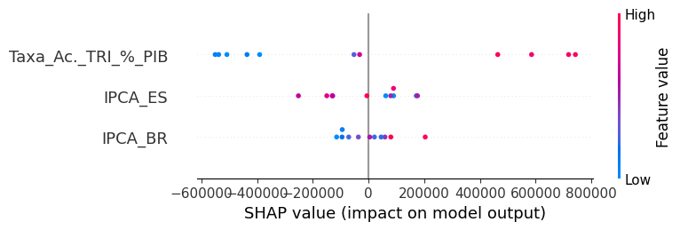

# Documentação Modelo Preditivo - Inteli

## GaIA Predict
### GaIA
#### Carolina Pascarelli, Felipe de Melo Elgennei, João Victor Wandermurem de Oliveira, Laura Rodrigues, Larissa Martins, Lucas Guerra Vicente, Ryan Gartlan

## Sumário
[1. Introdução](#c1)

[2. Objetivos e Justificativa](#c2)
- [2.1 Objetivos](#c2.1)
- [2.2 Proposta de solução](#c2.2)
- [2.3 Justificativa](#c2.2)

[3. Metodologia](#c3)
- [3.1 Entendimento do Negócio](#c3.1)
- [3.2 Entendimento dos Dados](#c3.2)
- [3.3 Preparação dos dados](#c3.3)
- [3.4 Modelagem](#c3.4)
- [3.5 Avaliação](#c3.5)
- [3.6 Implementação](#c3.6)

[4. Desenvolvimento e Resultados](#c4)
- [4.1 Compreensão do Problema](#c4.1)
  - [4.1.1 Contexto da indústria](#c4.1.1)
  - [4.1.2 Análise SWOT](#c4.1.2)
  - [4.1.3 Planejamento Geral da Solução](#c4.1.3)
  - [4.1.4 Value Proposition Canvas](#c4.1.4)
  - [4.1.5 Matriz de Riscos](#c4.1.5)
  - [4.1.6 Personas](#c4.1.6)
  - [4.1.7 User Stories](#c4.1.7)
  - [4.1.8 Jornadas do Usuário](#c4.1.8)
  - [4.1.9 Política de Privacidade](#c4.1.9)

- [4.2 Compreensão dos Dados](#c4.2)
  - [4.2.1 Exploração de dados](#c4.2.1)
  - [4.2.2 Pré-processamento dos dados](#c4.2.2)
  - [4.2.3 Hipóteses](#c4.2.3)

- [4.3  Preparação dos Dados e Modelagem](#c4.3)
  - [4.3.1  Seleção de Features e Construção do Modelo](#c4.3.1)
  - [4.3.2 Avaliação do Modelo e Discussão de Resultados](#c4.3.2)
  - [4.3.3 Conclusão](#c4.3.3)

- [4.4 Comparação de Modelos](#c4.4)
  - [4.4.1 Modelo XGboost](#c4.4.1)
  - [4.4.2 Rede Neural Artificial com Keras](#c4.4.2)
  - [4.4.3 Random Forest Regressor](#c4.4.3)
  - [4.4.4 Sarimax](#c4.4.4)
  - [4.4.5 Comparação das Métricas](#c4.4.5)

- [4.5 Metodologia](#c4.5)
  - [4.5.1 Modelo preditivo final](#c4.5.1)
  - [4.5.2 Atendimento dos Requisitos](#c4.5.2)
  - [4.5.3 Plano para caso de Falha do Modelo](#c4.5.3)
  - [4.5.4 Explicabilidade](#c4.5.4)
  - [4.5.5 Hipóteses sobre o Modelo Final](#c4.5.5)
  - [4.5.6 Descrição das Ferramentas e Plataformas Utilizadas](#c4.5.6)
  - [4.5.7 Conclusão](#c4.5.7)

[5. Conclusões e Recomendações](#c5)
  - [5.1 Principais Resultados](#c5.1)
  - [5.2 Recomendações ao Usuário](#c5.2)
  - [5.3 Métricas alcançadas pelo Modelo](#c5.3)

[6. Referências](#c6)

[7. Anexos](#attachments)

## 1. Introdução
&nbsp;&nbsp;&nbsp;&nbsp;A Rede Gazeta é o maior grupo de comunicação do Espírito Santo, Brasil, com uma audiência de 3,87 milhões de espectadores. Fundada em 1928 com o jornal A Gazeta, a empresa expandiu sua atuação para incluir um site de notícias, oito rádios e quatro emissoras de TV aberta afiliadas à Rede Globo, além de gerenciar os portais G1 Espírito Santo e Globo Esporte Espírito Santo. Com mais de 500 funcionários, a Rede Gazeta tem como missão informar, entreter e prestar serviços de comunicação de alta qualidade, com um compromisso firme com a ética e a inovação. A empresa desempenha um papel fundamental no desenvolvimento socioeconômico e cultural do Espírito Santo, sempre alinhando seus serviços às necessidades e interesses da comunidade local.

&nbsp;&nbsp;&nbsp;&nbsp;Apesar de sua presença marcante, a Rede Gazeta enfrenta desafios na definição de metas de vendas de publicidade, que atualmente se baseiam apenas no desempenho do ano anterior, tendo dificulade em considerar precisamente fatores como sazonalidade e eventos extraordinários. Isso pode levar a metas de baixa a média precisão, alocação pouco eficiente de recursos e desmotivação da equipe comercial. Para enfrentar essa situação, a empresa buscou o apoio do Inteli (Instituto de Tecnologia e Liderança) para desenvolver um modelo preditivo de receitas publicitárias, que promete criar metas otimizadas, alinhadas com as condições do mercado, maximizando a previsão de receita futura.

## 2. Objetivos e Justificativa
### 2.1 Objetivos
&nbsp;&nbsp;&nbsp;&nbsp;O parceiro de negócios busca aprimorar a definição das metas de vendas de publicidade, atualmente baseada apenas no desempenho do ano anterior, para uma abordagem mais técnica e quantitativa, baseada em dados. O objetivo geral é prever o potencial de receita futura com maior assertividade, maximizando os resultados da empresa. Já os objetivos especificos são:
- Considerar a sazonalidade e a evolução do desempenho dos principais setores dos clientes na definição das metas.
- Incluir eventos extraordinários e esporádicos de alta concentração de receita e/ou audiência na previsão de metas.
- Integrar métricas como taxas de ocupação do inventário e taxas de desconto aplicadas para aumentar a precisão das metas e a rentabilidade do negócio.

###  2.2 Proposta de solução

&nbsp;&nbsp;&nbsp;&nbsp; Dado o problema trazido pelo parceiro sobre a falta de precisão para a definição de metas de venda de publicidade, já que a mesma é feita levando em consideração o desempenho do ano anterior e o bom senso dos gestores, nos foi proposto o desenvolvimento de um modelo preditivo para auxiliar o parceiro com a assertividade do potencial de receita futura.

&nbsp;&nbsp;&nbsp;&nbsp;Dessa forma, pretende-se desenvolver a solução com base na alimentação de sistemas de machine learning com os dados fornecidos pelo parceiro de receitas anteriores. Assim, utiliza-se a modelagem preditiva para conseguir calcular com maior precisão em quais setores os investimentos devem ser feitos.

&nbsp;&nbsp;&nbsp;&nbsp; O modelo preditivo que será feito pelo grupo será muito mais preciso do que apenas a análise de receitas prévias, pois irá considerar diversos fatores como sazonalidade, eventos extraordinários ou esporádicos, evolução dos principais setores, tendências de mercado, entre outros aspectos. Assim, irá auxiliar não apenas com o aumento da receita mas também com o engajamento do público alvo.

&nbsp;&nbsp;&nbsp;&nbsp; Por se tratar de um sistema de machine learning, quanto mais o sistema for alimentado mais preciso ele se tornará. Dessa forma, com o constante uso da modelagem ela se tornará cada vez mais exata, otimizando cada vez mais a receita da empresa. 

&nbsp;&nbsp;&nbsp;&nbsp; Pretende-se desenvolver uma interface simples de ser entendida para que os gestores consigam facilmente visualizar os setores com maior potencial, aumentando a confiança na hora dos investimentos.

&nbsp;&nbsp;&nbsp;&nbsp; O sucesso do modelo preditivo será avaliado de acordo com a precisão das previsões geradas. Dessa forma, poderemos avaliar se as previsões dadas pelo modelo condizem com as metas reais que foram estabelecidas pela equipe. Além disso, o aumento do retorno do investimento nestas campanhas publicitárias após a implantação da modelagem também será um critério de sucesso.

###  2.3 Justificativa
&nbsp;&nbsp;&nbsp;&nbsp;A solução proposta, baseada em um modelo preditivo de machine learning, oferece uma abordagem mais precisa e eficaz pois auxilia de maneira técnica e quantitativa a definição de metas de vendas de publicidade. Diferente do método atual, que depende de dados históricos e experiência dos profissionais de negócios, o modelo considera uma variedade de fatores como sazonalidade, eventos extraordinários e tendências de mercado, permitindo previsões mais assertivas.

&nbsp;&nbsp;&nbsp;&nbsp;Ainda, os principais benefícios incluem o aumento da receita e do engajamento do público-alvo, além da capacidade do modelo de melhorar continuamente à medida que mais dados são incorporados. A simplicidade da interface permitirá que os gestores tomem decisões informadas com maior confiança, diferenciando-se das abordagens tradicionais e proporcionando uma vantagem competitiva sustentável.

## 3. Metodologia

&nbsp;&nbsp;&nbsp;&nbsp;A metodologia CRISP-DM (Cross Industry Standard Process for Data Mining) é um modelo amplamente adotado para guiar projetos de mineração de dados em diversas indústrias. Ele oferece uma abordagem estruturada que ajuda a garantir que o processo seja eficiente e que os resultados atendam aos objetivos de negócio. Abaixo está uma descrição mais detalhada de cada uma de suas etapas:

### 3.1 Entendimento do Negócio

&nbsp;&nbsp;&nbsp;&nbsp;A primeira etapa é o **Entendimento do Negócio**. Nesta fase, o foco está em compreender profundamente o contexto empresarial, os objetivos estratégicos e os problemas específicos que precisam ser resolvidos. Aqui, é importante traduzir as necessidades do negócio em questões de mineração de dados, definindo metas claras e viáveis. Também é nessa etapa que se determina os critérios de sucesso, que orientarão a avaliação dos resultados ao longo do projeto.

### 3.2 Entendimento dos Dados

&nbsp;&nbsp;&nbsp;&nbsp;O **Entendimento dos Dados** é a segunda fase, onde os dados disponíveis são explorados e analisados de forma inicial. O objetivo é compreender a estrutura, a qualidade e a relevância desses dados para o problema em questão. Nesta etapa, são realizadas atividades como a coleta de dados, a identificação de falhas ou valores ausentes, e a realização de análises exploratórias para obter insights preliminares. Esse processo ajuda a identificar potenciais desafios e oportunidades antes de avançar para as próximas etapas.

### 3.3 Preparação dos dados

&nbsp;&nbsp;&nbsp;&nbsp;A etapa de **Preparação dos Dados** é fundamental para garantir que os dados estejam prontos para serem utilizados na modelagem. Nessa fase, ocorre a limpeza e transformação dos dados, o que pode incluir a correção de erros, tratamento de valores faltantes, criação de novas variáveis e normalização dos dados. O objetivo é garantir que os dados sejam adequados e consistentes, permitindo que o modelo seja o mais eficiente e preciso possível.

### 3.4 Modelagem

&nbsp;&nbsp;&nbsp;&nbsp;A **Modelagem** é a etapa em que as técnicas de mineração de dados propriamente ditas são aplicadas. Nessa fase, são escolhidos algoritmos e técnicas de modelagem adequados ao problema, como regressão, classificação, clustering ou redes neurais. Diferentes modelos podem ser criados e testados, dependendo dos dados e do objetivo do negócio. É importante lembrar que a escolha dos modelos deve ser feita considerando as características dos dados preparados na etapa anterior.

### 3.5 Avaliação

&nbsp;&nbsp;&nbsp;&nbsp;Após a construção dos modelos, a fase de **Avaliação** verifica a eficácia e a precisão das soluções geradas. Nesta etapa, os modelos são avaliados de acordo com os critérios de sucesso definidos no início do processo. O objetivo é garantir que o modelo não apenas atenda aos requisitos técnicos, mas também ofereça valor para o negócio. Caso os resultados não sejam satisfatórios, pode ser necessário retornar a etapas anteriores para ajustes, como modificar a preparação dos dados ou testar novos modelos.

### 3.6 Implementação

&nbsp;&nbsp;&nbsp;&nbsp;Finalmente, a fase de **Implementação** envolve a integração do modelo no ambiente de produção. Aqui, o modelo passa a ser utilizado para gerar previsões ou tomar decisões baseadas em dados reais. Esta etapa pode incluir a criação de sistemas de relatórios automatizados, dashboards, ou mesmo a integração com sistemas de TI existentes. Além disso, é importante planejar o monitoramento contínuo do modelo para garantir que ele continue fornecendo resultados relevantes ao longo do tempo.

&nbsp;&nbsp;&nbsp;&nbsp;Essas seis etapas formam um ciclo flexível, onde o retorno a fases anteriores é comum quando necessário, permitindo ajustes contínuos para garantir que o modelo final atenda plenamente aos objetivos de negócio.

&nbsp;&nbsp;&nbsp;&nbsp;Em suma, a metodologia **CRISP-DM** oferece um framework abrangente e flexível para o desenvolvimento de projetos de mineração de dados, orientando desde o entendimento inicial do problema de negócio até a implementação e monitoramento contínuo do modelo. Suas etapas interligadas permitem um processo iterativo, garantindo que cada fase seja revisada e ajustada conforme necessário para maximizar a eficiência e a qualidade dos resultados. Ao seguir esse modelo, as empresas podem tomar decisões mais informadas, extrair insights valiosos dos dados e, consequentemente, alcançar uma maior competitividade no mercado.

## 4. Desenvolvimento e Resultados
###  4.1. Compreensão do Problema
#### 4.1.1. Contexto da indústria 
 
&nbsp;&nbsp;&nbsp;&nbsp;A Rede Gazeta, maior grupo de comunicação do Espírito Santo, Brasil, tem uma presença marcante na mídia local, com 3,87 milhões de espectadores. Fundada em 1928 com o jornal A Gazeta, a empresa se expandiu para incluir um site de notícias, oito rádios e quatro emissoras de TV aberta afiliadas à Rede Globo. Além disso, opera dois portais de notícias locais dentro do ecossistema Globo: G1 Espírito Santo e Globo Esporte Espírito Santo.

&nbsp;&nbsp;&nbsp;&nbsp;Com uma equipe de mais de 500 funcionários, a missão da Rede Gazeta é informar, entreter e prestar serviços de comunicação ao público capixaba com foco em qualidade, ética e inovação. A empresa visa contribuir para o desenvolvimento socioeconômico, cultural e da cidadania no Espírito Santo, alinhando seus serviços de mídia às necessidades e interesses da comunidade local.

&nbsp;&nbsp;&nbsp;&nbsp;No entanto, a Rede Gazeta enfrenta uma competição no cenário da mídia local. Entre seus principais concorrentes estão a TV Vitória, afiliada à Record TV, que oferece uma programação diversificada e compete diretamente com a TV Gazeta. No segmento de jornais, o Jornal A Tribuna e a Folha Vitória disputam a audiência e a cobertura de notícias com a Rede Gazeta. Além disso, a Rádio Jovem Pan Espírito Santo e a Rádio CBN Vitória são concorrentes diretas das rádios da Rede Gazeta, oferecendo programação focada em notícias e entretenimento.

&nbsp;&nbsp;&nbsp;&nbsp;Atualmente, um desafio para a Rede Gazeta é a definição atual de metas de venda de publicidade para o time comercial, que está unicamente baseada no desempenho do ano anterior. Esse método desconsidera uma série de fatores críticos, como sazonalidade, evolução de desempenho dos principais setores dos nossos clientes, e eventos extraordinários ou esporádicos de alta concentração de receita e/ou audiência, que poderiam ser destacados no histórico e previstos com boa assertividade no calendário anual ou nos meses seguintes, são frequentemente ignorados. Isso força a empresa a se adaptar e inovar para estabelecer metas mais precisas e relevantes.

&nbsp;&nbsp;&nbsp;&nbsp;Nesse cenário, a falta de uma análise baseada em dados ocasiona a definição de metas de vendas de publicidade desatualizadas e potencialmente inadequadas. Isso gera uma série de problemas, como a alocação ineficiente de recursos, expectativas desalinhadas com a realidade do mercado, e a perda de oportunidades de maximizar a receita. Além disso, pode resultar em desmotivação da equipe comercial, que enfrenta metas pouco realistas ou desconectadas das condições atuais, impactando negativamente o desempenho geral da empresa.

&nbsp;&nbsp;&nbsp;&nbsp;Visando essa ocorrência, a Rede Gazeta procurou o Inteli (Instituto de tecnologia e liderança) para realizar um projeto com o objetivo de prever o potencial de receita futura com maior assertividade, maximizando o resultado esperado da empresa. Esse programa consiste em um modelo preditivo de receitas publicitárias por setor econômico da empresa.

&nbsp;&nbsp;&nbsp;&nbsp;Para fornecer um melhor contexto da industria, uma análise das 5 forças de porter da A gazeta trás uma perspectiva mais clara sobre o contexto do parceiro, tendo como parâmetro os concorrentes, clientes e os serviços/produtos oferecidos.
 

Figura 1 - 5 forças de porter A gazeta

Fonte: Material produzido pelos autores (2024)

1. **Ameaça de novos entrantes**
A barreira de entrada no setor de mídia e comunicação é alta, principalmente devido aos significativos investimentos necessários em infraestrutura, tecnologia, e aquisição de direitos de transmissão. A reputação estabelecida da Rede Gazeta, somada à sua longa história e forte reconhecimento de marca, cria obstáculos significativos para novos concorrentes. Além disso, a afiliação com a TV Globo proporciona uma vantagem competitiva adicional, reduzindo ainda mais a ameaça de novos entrantes. A entrada no mercado também é dificultada pela necessidade de uma base  de anunciantes e assinantes, algo que a Rede Gazeta já possui​.

2. **Poder de negociação dos fornecedores**
A Rede Gazeta depende de uma variedade de fornecedores para materiais como equipamentos de transmissão e tecnologia digital. No entanto, a empresa mitiga o poder de barganha desses fornecedores através da diversificação e da escala de suas operações. Devido ao volume de compras a Rede Gazeta pode negociar condições mais favoráveis gerando a capacidade de alternar entre diferentes fornecedores sem grande impacto operacional também diminui o poder de barganha dos fornecedores​.

3. **Poder de negociação dos compradores**
Os compradores, compostos por anunciantes e assinantes, têm um poder significativo. Entretanto, a Rede Gazeta atenua esse poder ao oferecer uma ampla gama de serviços e plataformas, incluindo rádios, televisões e canais digitais. Essa diversificação de produtos e canais de distribuição permite que a empresa reduza sua dependência de qualquer grupo específico de compradores, fortalecendo sua posição de negociação. A variedade de opções oferecidas aos anunciantes também aumenta o valor percebido pelos compradores, diminuindo sua capacidade de negociar grandes descontos.

4. **Ameaça de produtos substitutos**
A ameaça de produtos substitutos é alta, principalmente devido ao crescimento das plataformas de mídia digital e redes sociais que atraem tanto o público quanto os anunciantes. Plataformas como YouTube, Facebook e Instagram oferecem alternativas viáveis e frequentemente mais baratas para anunciantes. No entanto, a Rede Gazeta tem se adaptado a essas mudanças através da digitalização de seus serviços e do desenvolvimento de novos produtos digitais, como newsletters, podcasts e portais de notícias, que ajudam a manter sua relevância e competitividade no mercado​.

5. **Rivalidade entre concorrentes**
A rivalidade no setor de mídia e comunicação é intensa, com várias empresas competindo por audiência e receita publicitária. No entanto, a Rede Gazeta possui uma posição forte no Espírito Santo, sendo o maior conglomerado de mídia do estado. Isso lhe confere uma vantagem competitiva significativa. A afiliação com a TV Globo também fortalece sua posição de mercado, oferecendo conteúdo de alta qualidade e uma ampla audiência. Entretanto, no mercado existem competidores da rede Gazeta em TV, jornal e rádio e são respectivamente a Tv Vitória/Record TV, o jornal A Tribuna e a rádio BandNews FM Espírito Santo.

####  4.1.2. Análise SWOT

&nbsp;&nbsp;&nbsp;&nbsp;A análise SWOT é uma ferramenta estratégica utilizada para avaliar as forças(Strengths), fraquezas(Weaknesses), oportunidades(Opportunities) e ameaças(Threats) de uma empresa, projeto ou iniciativa. Essa análise permite que empresas e indivíduos encontrem os fatores internos e externos que podem impactar seu sucesso, facilitando a elaboração de estratégias mais bem formadas e eficazes. Ao proporcionar uma visão melhor do ambiente competitivo e das capacidades internas, a análise SWOT ajuda na tomada de decisões e na criação de planos direcionados a alcançar os objetivos desejados.

Figura 2- Análise SWOT

Fonte: Material produzido pelos autores (2024)

&nbsp;&nbsp;&nbsp;&nbsp;As fortalezas da Rede Gazeta são seu nome consolidado no mercado, que confere credibilidade e reconhecimento entre os consumidores, sua infraestrutura totalmente online, facilitando a compartilhação de mídia e permitindo uma operação contínua e eficiente, o conteúdo diversificado, que atrai uma ampla gama de clientes e atende a diferentes interesses e necessidades, além disso, a não dependência da presença física dos funcionários assegura a consistência e continuidade dos trabalhos, mesmo em situações adversas, como uma nova pandemia global, garantindo a resiliência e adaptabilidade da empresa.

&nbsp;&nbsp;&nbsp;&nbsp;Já suas fraquezas são o desafios em atrair e engajar o público jovem, particularmente na faixa etária de 18 a 35 anos, que é um segmento crucial para o crescimento e a inovação e a dificuldades em acompanhar o rápido fluxo e as constantes mudanças nas redes sociais, o que pode resultar em perda de relevância e competitividade em um ambiente onde a presença digital é cada vez mais importante para o sucesso.

&nbsp;&nbsp;&nbsp;&nbsp;Indo para as oportunidades, o mercado crescente no estado do Espírito Santo oferece uma excelente oportunidade para a empresa expandir sua presença regional e fortalecer suas operações locais. Com a diversificação dos conteúdos, há um grande potencial para alcançar um público ainda maior, aproveitando o interesse crescente por mídias digitais e plataformas online. Além disso, ao reposicionar a marca e afastar a imagem de um jornal tradicional de papel, a empresa pode renovar sua identidade e se conectar mais eficazmente com o público moderno, atraindo novos leitores e fortalecendo sua relevância no mercado atual.

&nbsp;&nbsp;&nbsp;&nbsp;Por ultimo, as ameaças são o surgimento e o crescimento de canais de informação alternativos, que oferecem novos formatos de mídia e atraem um público diversificado. As crises econômicas também representam uma ameaça constante, pois podem afetar tanto a demanda por seus produtos quanto a disponibilidade de recursos para investir em inovação e expansão. Além disso, a concorrência com redes sociais é intensa, já que estas plataformas capturam uma grande parte da atenção do público e das receitas publicitárias. A competição com outras emissoras também pressiona a empresa a se manter competitiva em um mercado saturado. Por fim, a concentração de receita em poucos canais ou clientes pode representar um risco financeiro significativo, aumentando a vulnerabilidade da empresa a mudanças repentinas no mercado ou na economia.

&nbsp;&nbsp;&nbsp;&nbsp;Em resumo, a Rede Gazeta possui uma base forte, com um nome consolidado e uma operação online que garante resiliência. No entanto, enfrenta desafios em atrair o público jovem e se adaptar ao ritmo das redes sociais. As oportunidades no mercado do Espírito Santo e a possibilidade de renovar sua imagem oferecem potencial de crescimento. Entretanto, a empresa deve estar vigilante em relação às ameaças, como novas mídias, crises econômicas e a concentração de receita, que podem impactar sua estabilidade no mercado.

####  4.1.3. Planejamento Geral da Solução

&nbsp;&nbsp;&nbsp;&nbsp;O grupo está desenvolvendo um modelo preditivo para aprimorar a definição das metas de venda de publicidade, que atualmente se baseiam apenas no desempenho anterior e na intuição dos gestores. Utilizando dados disponíveis, como planilhas de audiência dos principais veículos e dados econômicos como o índice de ajuste sazonal e variações, o modelo fará uso de técnicas de machine learning para analisar receitas passadas. Além disso, o modelo considerará fatores como sazonalidade, eventos extraordinários, evolução setorial e tendências de mercado.

&nbsp;&nbsp;&nbsp;&nbsp;O modelo preditivo se encaixa na categoria de regressão, um tipo de técnica de machine learning destinada a prever valores contínuos que podem variar dentro de um intervalo. Isso difere de modelos de classificação, que são usados para prever categorias ou classes específicas.

&nbsp;&nbsp;&nbsp;&nbsp;Com uma interface clara e simples, o modelo permitirá uma tomada de decisão estratégica mais eficaz em relação às receitas e às metas de venda. Como benefício, os parceiros terão metas mais alcançáveis e poderão tomar decisões mais informadas, com uma visualização clara das previsões anuais, levando em consideração possíveis sazonalidades.

&nbsp;&nbsp;&nbsp;&nbsp;O sucesso do modelo preditivo será avaliado com base na precisão das previsões geradas. Assim, será possível determinar se as previsões do modelo correspondem às metas reais estabelecidas pela equipe. No entanto, a avaliação quantitativa do sucesso será aprimorada nas próximas sprints de desenvolvimento do projeto.

#### 4.1.4. Value Proposition Canvas

&nbsp;&nbsp;&nbsp;&nbsp;Sabe-se que, segundo Philip Kotler, reconhecido como pai do marketing moderno, a proposta de valor é um conjunto de benefícios ou valores que se promete oferecer aos clientes para satisfazer suas necessidades. Dessa forma, utiliza-se a Canvas de Proposta de Valor como uma forma clara e objetiva de definir o “fit” entre o seu segmento de clientes e a sua proposta de valor. Com base nisso, o Value Proposition Canvas foi elaborado de acordo com a solução que está sendo desenvolvida.

Figura 3- Value Proposition Canvas

Fonte: Material produzido pelos autores (2024)

&nbsp;&nbsp;&nbsp;&nbsp;A fim de que haja um maior entendimento do parceiro, foi desenvolvido um perfil detalhado do cliente Gazeta. Esse perfil foi baseado em três pilares: as tarefas que o cliente precisa realizar, as dores que ele enfrenta no processo e os ganhos que ele busca alcançar.

- **Tarefas do Cliente:** Por meio do TAPI (Termo de Abertura do Projeto Inteli) que formaliza o início dessa solução, identificou-se que as principais atividades desejadas pelo cliente envolvem a utilização de dados como base para suas decisões estratégicas. Especificamente, ele busca analisar o desempenho dos empreendimentos em diferentes regiões do estado e por tipo de veículo de comunicação, além de prever períodos de alta receita e audiência ao longo do ano.

- **Dores do Cliente:** As principais dores do cliente estão associadas à perda de oportunidades de crescimento, prejuízos decorrentes de investimentos sem retorno, e falta de engajamento do público-alvo. Esses problemas surgem, em grande parte, devido à subutilização dos dados disponíveis, o que compromete a assertividade das decisões de negócios.

- **Ganhos Potenciais:** Entre os possíveis ganhos, destacam-se a ampliação do entendimento das tendências do mercado, a expansão do público-alvo e a maior assertividade nos investimentos. O uso preciso dos dados pode proporcionar insights valiosos, permitindo ao cliente tomar decisões mais certeiras aumentando a eficiência do negócio.

&nbsp;&nbsp;&nbsp;&nbsp;Com base no entendimento do cliente, suas tarefas, dores e ganhos, foi possível definir o produto, ou seja, a solução que será oferecida conforme as necessidades identificadas. Com isso, visou-se definir os produtos e serviços oferecidos, os criadores de ganhos e os aliviadores de dores.

- **Produtos e Serviços:** Perante as tarefas identificadas do cliente, ponderou-se que os produtos e serviços oferecidos deveriam incluir um modelo preditivo para previsão de receita e a representação visual de dados. Por meio disso, espera-se aprimorar o processo de tomada de decisão, bem como as análises e previsões.

- **Aliviadores de Dores:** Na elaboração dos aliviadores de dores, focou-se em facilitar o processo de tomada de decisão e reduzir os prejuízos em geral, pois com a análise precisa dos dados pode-se haver um maior aproveitamento de oportunidades.

- **Criadores de Ganhos:** Os pontos capazes de gerar ganhos para os clientes estão fundamentados em oferecer previsões precisas, identificação de riscos e possibilidade de reconhecimento de possíveis ajustes de personalização dos produtos e serviços oferecidos pela empresa parceira.

&nbsp;&nbsp;&nbsp;&nbsp;Em suma, conclui-se que a aplicação do Value Proposition Canvas,facilita a identificação das necessidades, dores e expectativas do cliente, permitindo o desenvolvimento compatível da solução. Desse modo, reflete-se o alinhamento entre o que está sendo requerido e o que pode ser ofertado. Por fim, pode-se determinar a proposta de valor que proporcione benefícios assertivos ao cliente, atingindo os resultados esperados pela Gazeta.

#### 4.1.5. Matriz de Riscos

Figura 4- Matriz de Risco

Fonte: Material produzido pelos autores (2024)

A matriz de probabilidade e impacto é uma ferramenta visual usada para avaliar e priorizar riscos e oportunidades, destacando aquelas que exigem mais atenção com base em suas probabilidades de ocorrência e impactos potenciais. Durante a fase de avaliação, essa ferramenta foi utilizada para analisar variáveis que podem influenciar o sucesso do projeto. Essa análise orientará as decisões estratégicas e as ações para mitigar riscos e maximizar oportunidades.

#### Riscos e Medidas de Mitigação

- **Percas do trabalho**:  
  Erros no gitflow resultando em perdas de trabalho podem comprometer o projeto.  
  **Mitigação**: Implementar práticas de controle de versão e fluxo de trabalho no Git, como revisões de código, é essencial. Além disso, oferecer treinamento à equipe e estabelecer backups frequentes evitarão perdas significativas de trabalho.

- **Subestimação da complexidade inicial**:  
  A complexidade do projeto pode ser subestimada se não houver uma análise detalhada desde o início.  
  **Mitigação**: Realizar uma análise do escopo do projeto desde o início, envolvendo especialistas para garantir uma visão realista. Estabelecer marcos de revisão periódicos permitirá reavaliar e ajustar o escopo conforme necessário.

- **Erro na previsão de receita**:  
  Devido a dados insuficientes ou inadequados, as previsões de receita podem ser imprecisas.  
  **Mitigação**: Assegurar a qualidade dos dados desde o início, com uma análise criteriosa dos dados disponíveis, é crucial. Implementar técnicas de limpeza e validação de dados, além de considerar a coleta de dados adicionais ou complementares, pode melhorar a precisão das previsões.

- **Atraso no envio da base de dados**:  
  A base de dados necessária para iniciar o projeto pode não ser enviada a tempo pelo parceiro.  
  **Mitigação**: Estabelecer prazos claros e negociar antecipadamente com os fornecedores de dados é vital. Manter comunicação contínua com as partes envolvidas e ter fontes de dados alternativas como plano B ajudará a evitar atrasos críticos.

- **Problemas de comunicação**:  
  A comunicação entre as equipes envolvidas pode falhar, impactando o andamento do projeto.  
  **Mitigação**: Criar canais de comunicação eficazes e estabelecer uma rotina de reuniões regulares são práticas recomendadas. Utilizar ferramentas colaborativas e designar pontos focais de comunicação para cada equipe garantirá o alinhamento e o acesso às informações por todos os membros.

- **Incapacidade de ajustar previsões em tempo real**:  
  A falta de infraestrutura tecnológica pode impedir ajustes rápidos nas previsões.  
  **Mitigação**: Avaliar a infraestrutura tecnológica necessária no início do projeto é fundamental. Planejar investimentos na atualização ou aquisição de sistemas adequados e incluir a equipe técnica na escolha e implementação das soluções ajudará a evitar essa incapacidade.

- **Atrasos na entrega de tarefas**:  
  Devido à sobrecarga acadêmica ou outros compromissos estudantis, tarefas podem ser entregues com atraso.  
  **Mitigação**: Flexibilizar prazos internos e criar um cronograma que leve em consideração a carga acadêmica dos estudantes é importante. Priorizar tarefas críticas e redistribuir o trabalho dentro da equipe também contribuirá para evitar atrasos.

- **Falha em seguir a LGPD**:  
  A falha em garantir a privacidade e anonimização dos dados conforme a LGPD pode resultar em penalidades.  
  **Mitigação**: Implementar políticas de proteção de dados e anonimização desde o início é crucial. Treinar a equipe sobre as exigências da LGPD, utilizar ferramentas adequadas para garantir a conformidade e realizar auditorias periódicas para verificar a adequação dos processos de tratamento de dados serão passos essenciais para evitar problemas com a LGPD.

#### Oportunidades

- **Melhoria da precisão e flexibilidade das metas de receita:**
Ao ajustar metas de receita com base em modelos preditivos que utilizam dados históricos e tendências, é possível aumentar a precisão das projeções financeiras. Isso permite que a empresa se adapte rapidamente às mudanças de mercado, mantendo metas realistas e atingíveis, o que é crucial para o planejamento estratégico e a gestão eficaz.

- **Criação de um MVP que justifique futuros investimentos em tecnologia:**
Desenvolver um MVP oferece a oportunidade de demonstrar o valor de novas tecnologias antes de realizar investimentos significativos. Essa abordagem permite testar a viabilidade de um projeto em um ambiente controlado, minimizando riscos e garantindo que os recursos sejam alocados de forma eficiente, com base em resultados tangíveis.

- **Ganho de competitividade com o uso de dados nas decisões comerciais:**
A utilização de dados para fundamentar decisões comerciais representa uma oportunidade de tornar essas decisões mais estratégicas e informadas. Com insights precisos, a empresa pode identificar tendências, antecipar mudanças no mercado e ajustar suas estratégias para manter ou ganhar vantagem competitiva.

- **Alocação de recursos aprimorada com otimização baseada em previsões precisas:**
A oportunidade de otimizar a alocação de recursos com base em previsões precisas permite aumentar a eficiência operacional. Ao prever com maior precisão as necessidades futuras, a empresa pode distribuir recursos de maneira mais eficaz, evitando desperdícios e maximizando o retorno sobre os investimentos.

- **Melhoria da transparência com stakeholders:**
Fortalecer a transparência com os stakeholders através de relatórios claros e dashboards acessíveis oferece a oportunidade de construir confiança e melhorar a comunicação. Essa prática não só melhora o relacionamento com as partes interessadas, mas também facilita a tomada de decisões informadas e a colaboração em projetos críticos.

- **Redução de desperdício em campanhas publicitárias:**
A otimização dos gastos em campanhas publicitárias representa uma oportunidade significativa para melhorar o retorno sobre o investimento. Ao analisar o desempenho das campanhas em tempo real, a empresa pode ajustar suas estratégias de marketing, reduzindo desperdícios e focando em abordagens que gerem resultados melhores e mais rápidos.

- **Inovação em processos internos:**
A introdução de novas práticas e tecnologias nos processos internos oferece a oportunidade de aumentar a eficiência organizacional. Ao inovar, a empresa pode simplificar operações, reduzir custos e melhorar a qualidade dos produtos e serviços oferecidos, mantendo-se competitiva em um mercado em constante evolução.

A matriz de probabilidade e impacto permitiu que fossem mapeados riscos, como erros no gitflow e subestimação da complexidade, e destacadas oportunidades, como o aprimoramento das metas de receita e a criação de um MVP. Com a implementação das medidas de mitigação adequadas e o aproveitamento dessas oportunidades, a equipe está preparada para minimizar problemas e maximizar o valor do projeto, garantindo um desenvolvimento eficiente e seguro do modelo preditivo de receitas publicitárias.

#### 4.1.6. Personas

&nbsp;&nbsp;&nbsp;&nbsp;A técnica de criação de personas criada pelo programador e designer de software Alan Cooper, é uma ferramenta que busca definir de forma mais próxima a figura que representa o usuário final do produto. Com isso, produz-se uma série de fatores, como as necessidades, características, interesses e metas, que refletem como esse usuário pode ser ajudado pela solução a ser desenvolvida. Por meio da criação de personas alinhadas, desenvolve-se um entendimento maior do projeto ideal com base no cliente.

Figura 5- Persona 1
 

Fonte: Material produzido pelos autores (2024)

&nbsp;&nbsp;&nbsp;&nbsp;A primeira persona desenvolvida foi a [Ana Clara](#MapaAnaClara), que representa uma Analista de Sistemas recém-formada em Ciência da Computação, apaixonada por tecnologia e comunicação. Enquanto atuante na Gazeta, ela vivencia a dificuldade em embasar suas opiniões e carece de ferramentas avançadas para análise de dados. Sua meta principal é adquirir experiência com IA para o mercado de trabalho.

Figura 6- Persona 2
 

Fonte: Material produzido pelos autores (2024)

&nbsp;&nbsp;&nbsp;&nbsp;Além disso, criou-se também uma persona [Amanda](#MapaAmanda), Economista, com pós-graduação em Estatística, que sente dificuldades em se concentrar e tomar decisões em grupo. Com base nisso, suas principais necessidades são ter acesso facilitado às informações e ferramentas para visualização de dados. Ela deseja melhorar a previsão de receitas para segmentos do mercado e integrar os dados.

Figura 7- Persona 3
 

Fonte: Material produzido pelos autores (2024)

&nbsp;&nbsp;&nbsp;&nbsp;A última persona desenvolvida foi o [Marcos](#MapaMarcos), que representa um Gestor de Vendas nativo de Vitória, experiente no mercado, formado em Administração e com MBA em Gestão Comercial. Ele possui uma certa dificuldade de interagir com tecnologias mais novas, normalmente necessitando de ajuda de seus parceiros, devido a isso, uma de suas necessidades é a presença de uma UI clara e fácil de ser utilizada.

#### 4.1.7. User Stories

&nbsp;&nbsp;&nbsp;&nbsp;As User Stories são ferramentas usadas no desenvolvimento ágil de projetos, servindo como a ponte entre os usuários finais e a equipe de desenvolvimento. Elas capturam as necessidades e expectativas dos usuários em relação ao produto ou solução a ser criada. Em um projeto como o da Rede Gazeta, onde a construção de um modelo preditivo de receitas publicitárias por setor econômico é o foco, as User Stories garantem que todas as funcionalidades desenvolvidas estejam alinhadas com os objetivos dos stakeholders. Além disso, elas facilitam a comunicação entre as diferentes equipes envolvidas, permitindo que as tarefas sejam claramente definidas, priorizadas, e organizadas no Kanban, garantindo assim um fluxo de trabalho eficiente e colaborativo.

### **User Story 01: Sistema de Análise e Relatórios**

| Identificação | US01 |
| --- | --- |
| **Persona** | Ana Clara |
| **User Story** | "Como analista de sistemas da Gazeta, desejo utilizar um sistema para embasar minhas opiniões com dados sólidos para estabelecer metas e investimentos de receita." |
| **Critério de Aceitação 1** | CR1. O sistema deve permitir a análise detalhada de dados com opções de filtros avançados para interpretação personalizada. |
| **Critério de Aceitação 2** | CR2. Ana Clara deve conseguir acessar o sistema de forma rápida, com uma interface simplificada e eficiente para uso técnico. |
| **Critério de Aceitação 3** | CR3. O sistema deve oferecer opções de personalização de relatórios e análises conforme as necessidades específicas da equipe de TI e outros stakeholders. |
| **Critério de Aceitação 4** | CR4. O sistema deve permitir a exportação de resultados em múltiplos formatos, facilitando o compartilhamento de insights e integração em apresentações e documentos. |

### **User Story 02: Análise Financeira de Faturamento**

| Identificação | US02 |
| --- | --- |
| **Persona** | Amanda |
| **User Story** | "Como economista, desejo acessar um dashboard que indique com precisão informações sobre o faturamento da Rede Gazeta dos últimos anos e com base em variáveis sazonais e anuais para que eu possa tomar melhores decisões financeiras para a empresa." |
| **Critério de Aceite 1** | CR1. O dashboard deve fornecer acesso a dados históricos de faturamento, segmentados por anos e ajustáveis com variáveis sazonais e econômicas. |
| **Critério de Aceite 2** | CR2. A interface do usuário (UI) deve permitir a personalização das previsões financeiras com base em variáveis específicas inseridas por Amanda. |
| **Critério de Aceite 3** | CR3. O dashboard deve apresentar as informações financeiras de maneira visual e compreensível, facilitando a análise financeira detalhada. |
| **Critério de Aceite 4** | CR4. O sistema deve permitir a exportação de relatórios financeiros personalizados para uso em decisões estratégicas e apresentações. |

### **User Story 03: Previsão de Receitas Publicitárias**

| Identificação | US03 |
| --- | --- |
| **Persona** | Marcos Almeida |
| **User Story** | "Como gestor de vendas sênior da Rede Gazeta, quero utilizar um modelo preditivo de receitas publicitárias por setor econômico para que eu possa estabelecer metas de vendas mais assertivas e tomar decisões estratégicas baseadas em dados, melhorando a eficiência da equipe e maximizando o potencial de receita da empresa." |
| **Critério de Aceite 1** | CR1. O modelo deve prever a receita mensal para os próximos 12 meses, considerando sazonalidade e desempenho econômico dos setores. |
| **Critério de Aceite 2** | CR2. O modelo deve segmentar as previsões de receita por veículo de comunicação (TV, Rádio, Digital) e fornecer insights acionáveis para a equipe de vendas. |
| **Critério de Aceite 3** | CR3. A interface de usuário (UI) deve ser intuitiva e permitir que Marcos acesse rapidamente as previsões e crie relatórios ajustados às metas de vendas. |
| **Critério de Aceite 4** | CR4. As metas de vendas estabelecidas com base no modelo devem demonstrar maior precisão em relação às metas anteriores, ajudando Marcos a melhorar o desempenho da equipe. |

&nbsp;&nbsp;&nbsp;&nbsp;Através da definição das user stories para Ana Clara, Amanda, e Marcos Almeida, a equipe conseguiu alinhar as necessidades de diferentes stakeholders com o objetivo do projeto da Rede Gazeta. Cada user story foi desenhada para atender a uma função distinta dentro da organização, seja na previsão de receitas, na análise financeira, ou na interpretação de dados técnicos. Essa abordagem garante que o desenvolvimento das funcionalidades não apenas cumpra os requisitos técnicos, mas também agregue valor para os usuários finais. Ao organizar essas histórias no Kanban, a equipe pode priorizar as tarefas de maneira que o fluxo de trabalho se mantenha eficiente e direcionado para atingir os objetivos estratégicos da empresa.

#### 4.1.8. Jornadas do Usuário

&nbsp;&nbsp;&nbsp;&nbsp;Um mapa de jornada é uma representação visual que ilustra as experiências, emoções e interações de um usuário ao utilizar um produto, serviço ou sistema. Ele serve como uma ferramenta estratégica que permite à equipe de desenvolvimento compreender melhor o usuário, identificar pontos de dor, oportunidades e necessidades, e alinhar o desenvolvimento do produto às expectativas e demandas do cliente.

&nbsp;&nbsp;&nbsp;&nbsp;O primeiro mapa de jornada foi criado com base na persona **Ana Clara**, uma analista de sistemas recém-formada. Este mapa abrange as fases de exploração do sistema, inserção de dados, análise dos dados, personalização de relatórios e exportação dos resultados. Em cada fase, são destacadas as principais atividades realizadas por **Ana Clara**, bem como suas necessidades e possíveis frustrações, permitindo uma compreensão detalhada de como ela interage com o sistema e onde há oportunidades de melhorar sua experiência.

&nbsp;&nbsp;&nbsp;&nbsp;À medida que **Ana Clara** avança no uso do sistema, sua **insegurança inicial** sobre a inserção de dados **começa a diminuir com o feedback em tempo real**. Contudo, ainda há uma preocupação constante sobre como os resultados da análise serão interpretados e se eles realmente suportam suas decisões de negócios. **Ana Clara** também se sente **ansiosa para personalizar os relatórios**, temendo que o formato final não atenda completamente às suas necessidades. No entanto, ela se sente **aliviada** ao final do processo, quando os relatórios são exportados com sucesso. **Oportunidades de melhoria** incluem fornecer uma pré-visualização do relatório final e um feedback pós-exportação, aumentando a confiança de **Ana Clara** ao longo do processo.

Figura 8- Mapa de Jornada Persona 1
 

Fonte: Material produzido pelos autores (2024)

&nbsp;&nbsp;&nbsp;&nbsp;Também foi desenvolvido o mapa de jornada da persona **Amanda**, uma economista que busca uma plataforma eficiente para acessar dados financeiros e apoiar suas decisões de negócios. O mapa inclui as fases de identificação de necessidades, implementação da ferramenta, análise de dados, compartilhamento de resultados e revisão contínua das previsões. Esse processo reflete as expectativas de **Amanda** quanto à agilidade e precisão do sistema, além de sua necessidade de personalizar as análises financeiras conforme os dados mais recentes.

&nbsp;&nbsp;&nbsp;&nbsp;Embora **Amanda** fique **satisfeita** com a personalização inicial das variáveis sazonais e previsões, ela continua **preocupada** com a necessidade constante de ajustar as previsões à medida que surgem novas informações econômicas, o que reflete sua frustração com a **imprevisibilidade do mercado**. **Amanda** também sente que, apesar de o sistema fornecer visualizações claras, ainda há uma necessidade de recursos adicionais que permitam prever diferentes cenários econômicos de forma mais eficaz. A **evolução das frustrações** de **Amanda** ao longo da jornada está relacionada à constante necessidade de ajustes, o que pode ser atenuado com funcionalidades que ofereçam previsões mais dinâmicas e integradas aos dados externos.

Figura 9- Mapa de Jornada Persona 2
 

Fonte: Material produzido pelos autores (2024)

&nbsp;&nbsp;&nbsp;&nbsp;Por fim, foi elaborado o mapa de jornada da persona **Marcos Almeida**, um gestor de vendas que utiliza um sistema de análise de dados para otimizar processos de vendas, identificar novas oportunidades de mercado e tomar decisões informadas. O mapa foca nas fases de planejamento, coleta e preparação de dados, análise e interpretação dos resultados, personalização de relatórios e compartilhamento das informações com a equipe. Cada etapa evidencia as necessidades de **Marcos** por precisão nas análises e facilidade na utilização do sistema, fundamentais para o sucesso em suas atividades diárias.

&nbsp;&nbsp;&nbsp;&nbsp;Embora inicialmente **cauteloso** com a precisão dos dados coletados, **Marcos** vai ganhando **confiança nos insights** à medida que o sistema ajuda a identificar oportunidades de vendas com potencial real. **Sua ansiedade dá lugar a um sentimento de segurança** ao compartilhar relatórios confiáveis com sua equipe, sentindo-se confiante de que os dados suportam suas decisões estratégicas. **Marcos** expressa ainda **ansiedade sobre a personalização de relatórios**, mas essa preocupação é aliviada conforme ele observa o impacto positivo nas metas de vendas. A **oportunidade** aqui seria fornecer mais ferramentas de visualização dinâmica para que **Marcos** possa identificar automaticamente tendências de mercado, otimizando suas decisões de vendas.

Figura 10 - Mapa de Jornada Persona 3
 

Fonte: Material produzido pelos autores (2024)

&nbsp;&nbsp;&nbsp;&nbsp;Os mapas de jornada apresentados oferecem uma compreensão detalhada das interações dos usuários com o sistema, revelando pontos críticos de necessidade e oportunidades de melhoria. Eles destacam a importância de uma interface intuitiva, feedbacks claros, flexibilidade nas personalizações e suporte contínuo para garantir que cada persona consiga atingir seus objetivos de maneira eficaz. Ao mapear essas jornadas, fica claro como o desenvolvimento do produto pode ser orientado para não apenas atender, mas superar as expectativas dos usuários, garantindo uma experiência otimizada e centrada em suas necessidades reais.

####  4.1.9. Política de Privacidade
&nbsp;&nbsp;&nbsp;&nbsp;Última atualização: Aug 2024.

&nbsp;&nbsp;&nbsp;&nbsp;Política de Privacidade

##### 4.1.8.1 Informações gerais
&nbsp;&nbsp;&nbsp;&nbsp;A GaIA, pessoa jurídica de direito privado, com sede na Av. Prof. Almeida Prado, 520 - Butantã, São Paulo - SP, 05508-070, inscrita no CNPJ/MF sob o nº xx.xxx.xxx/xxxx-xx leva a sua privacidade a sério e zela pela segurança e proteção de dados de todos os seus clientes, parceiros, fornecedores e usuários (“Usuários” ou “você”).   

##### 4.1.8.2 Objetivo
&nbsp;&nbsp;&nbsp;&nbsp;A Política de Proteção e Privacidade de Dados do Grupo GaIA (“Política de privacidade”) tem como objetivo demonstrar o compromisso do Grupo GaIA com a transparência no tratamento dos Dados Pessoais dos Titulares. Este compromisso é particularmente relevante no contexto do nosso modelo preditivo de análise de dados, desenvolvido para nossos clientes. A Política expressa nosso comprometimento com a segurança nos serviços fornecidos, especialmente no tratamento de dados utilizados para a criação e operação deste modelo.

&nbsp;&nbsp;&nbsp;&nbsp;Esta Política é parte do Programa de Proteção e Privacidade de Dados do Grupo GaIA, composto por outros documentos, diretrizes, normas e procedimentos. Se você tiver alguma dúvida sobre o uso de Dados Pessoais, entre em contato com suporteHelp@gmail.com.

&nbsp;&nbsp;&nbsp;&nbsp;Caso você nos envie Dados Pessoais referentes a outras pessoas físicas, você declara ter a competência para fazê-lo e declara ter obtido o consentimento necessário para autorizar o uso de tais informações nos termos desta Política de Privacidade.

##### 4.1.8.3 Refêrencias
- Lei 13.709/2018 - Lei Geral de Proteção de Dados Pessoais.
- Lei 12.965/2014 - Marco Civil da Internet.

##### 4.1.8.4 Definições

&nbsp;&nbsp;&nbsp;&nbsp;Para os fins desta Política de Privacidade:

&nbsp;&nbsp;&nbsp;&nbsp;**“Dados Pessoais”** significa qualquer informação que, direta ou indiretamente, identifique ou possa identificar uma pessoa natural, como por exemplo, nome, CPF, data de nascimento, endereço IP, dentre outros;

&nbsp;&nbsp;&nbsp;&nbsp;**“Dados Pessoais Sensíveis”** significa qualquer informação que revele, em relação a uma pessoa natural, origem racial ou étnica, convicção religiosa, opinião política, filiação a sindicato ou a organização de caráter religioso, filosófico ou político, dado referente à saúde ou à vida sexual, dado genético ou biométrico;

&nbsp;&nbsp;&nbsp;&nbsp;**“Tratamento de Dados Pessoais”** significa qualquer operação efetuada no âmbito dos Dados Pessoais, por meio de meios automáticos ou não, tal como a recolha, gravação, organização, estruturação, armazenamento, adaptação ou alteração, recuperação, consulta, utilização, divulgação por transmissão, disseminação ou, alternativamente, disponibilização, harmonização ou associação, restrição, eliminação ou destruição. Também é considerado Tratamento de Dados Pessoais qualquer outra operação prevista nos termos da legislação aplicável;

&nbsp;&nbsp;&nbsp;&nbsp;**“Leis de Proteção de Dados”** significa todas as disposições legais que regulem o Tratamento de Dados Pessoais, incluindo, porém sem se limitar, a Lei nº 13.709/18, Lei Geral de Proteção de Dados Pessoais (“LGPD”).

##### 4.1.8.5 Uso de Dados Pessoais

&nbsp;&nbsp;&nbsp;&nbsp;Coletamos e usamos Dados Pessoais para gerenciar seu relacionamento conosco e melhor atendê-lo no contexto dos serviços oferecidos pelo Grupo, incluindo o desenvolvimento e operação do modelo preditivo de análise de dados.

&nbsp;&nbsp;&nbsp;&nbsp;Dados Coletados:
Coletamos dados como nome, CPF, data de nascimento, endereço IP, localização, entre outros. Além disso, podemos coletar dados de comportamento e padrões de uso, fundamentais para a melhoria contínua do nosso modelo preditivo.

&nbsp;&nbsp;&nbsp;&nbsp;Fonte de Coleta:
Os dados são coletados de bases de dados disponibilizadas por nossos clientes e parceiros, bem como por meio de interações diretas em nossa plataforma e outros pontos de contato digitais.

&nbsp;&nbsp;&nbsp;&nbsp;Finalidades de Uso:
Os dados pessoais são utilizados para:

- Desenvolvimento e aprimoramento do modelo preditivo de análise de dados.
- Personalização de serviços e melhoria na experiência do usuário.
- Atendimento a obrigações legais e regulatórias.
- Proteção das operações, detecção e prevenção de fraudes.
- Responder a processos judiciais e cumprir decisões de autoridades competentes.

##### 4.1.8.6 Armazenamento e Retenção de Dados
&nbsp;&nbsp;&nbsp;&nbsp;Os dados são armazenados em nossa infraestrutura local durante o período do módulo 3, o que acontecerá no dia 5 de agosto ao dia 10 de outubro de 2024

##### 4.1.8.7 Compartilhamento de Dados Pessoais
&nbsp;&nbsp;&nbsp;&nbsp;Podemos compartilhar seus Dados Pessoais com:

- Empresas parceiras que você selecionar para enviar seus dados;
- Provedores de serviços que gerenciam ou suportam aspectos das nossas operações.

##### 4.1.8.8 Medidas de Segurança
&nbsp;&nbsp;&nbsp;&nbsp;Adotamos medidas técnicas e organizacionais adequadas para proteger os Dados Pessoais que tratamos. No entanto, lembramos que nenhuma transmissão ou armazenamento de dados é 100% seguro, e incentivamos que você nos notifique imediatamente caso acredite que sua interação conosco deixou de ser segura.

##### 4.1.8.9 Direitos dos Usuários
&nbsp;&nbsp;&nbsp;&nbsp;Você tem o direito de solicitar:

&nbsp;&nbsp;&nbsp;&nbsp;Confirmação de tratamento de seus Dados Pessoais;
 
&nbsp;&nbsp;&nbsp;&nbsp;Acesso e correção dos seus Dados Pessoais;
 
&nbsp;&nbsp;&nbsp;&nbsp;Anonimização, bloqueio ou eliminação de dados desnecessários;
 
&nbsp;&nbsp;&nbsp;&nbsp;Portabilidade dos dados a outro prestador de serviços;
 
&nbsp;&nbsp;&nbsp;&nbsp;Informações sobre o compartilhamento de dados;
 
&nbsp;&nbsp;&nbsp;&nbsp;Revogação do consentimento dado anteriormente.

##### 4.1.8.10 Exercício de Direitos e Contato
&nbsp;&nbsp;&nbsp;&nbsp;Para exercer seus direitos ou resolver dúvidas sobre o Tratamento de seus Dados Pessoais, entre em contato com o nosso Encarregado de Proteção de Dados pelo e-mail suporteHelp@gmail.com.

##### 4.1.8.11 Atualizações desta Política de Privacidade
&nbsp;&nbsp;&nbsp;&nbsp;Esta Política de Privacidade pode ser atualizada periodicamente. Publicaremos a nova versão com a data de revisão atualizada. O uso contínuo da plataforma após as alterações implica na aceitação da Política revisada. Caso não concorde com os termos, recomendamos que interrompa o uso da plataforma.

### 4.2. Compreensão dos Dados

####  4.2.1. Exploração de dados

&nbsp;&nbsp;&nbsp;&nbsp;As tabelas a seguir foram feitas para facilitar a criação de gráficos que buscam encontrar sazonalidades, padrões e agrupamentos das váriaveis que chamassem a atenção. A escolha das váriaveis usadas neles vieram de discuções e conversas entre o grupo para decidir quais seriam os tópicos mais interessantes tanto para o treinamento do Modelo Preditivo quanto para a visualisação do cliente.

As colunas VL Tabela e Desconto, foram utilizadas no treinamento inicial dos modelos, entretanto, devido a uma análise mais aprofundada, elas foram retiradas do treinamento para uma melhor aproximação da realidade, já que não há sentido lógico em utilizar o valor líquido para descobrir o valor líquido final.

**Tabela Agosto**
|       |       VL Tabela |   Desconto |   R$ Vl Liquido Final |      IPCA ES |      IPCA BR |   % Ating. Meta |
|:------|----------------:|-----------:|----------------------:|-------------:|-------------:|----------------:|
| **Número de observações**  || 55897           |   55897    |       55897           | 55897        | 55897        |    55897        |
| **Média dos valores**  | 12966.5         |   -4000.15 |        7404.68        |     0.527857 |     0.505216 |        1.15782  |
|**Desvio padrão**  | 40186.6         |   14954.6  |       23936.9         |     0.50199  |     0.451214 |        0.382827 |
| **Valor mínimo**   |     1           | -812846    |           0.51        |    -1.31     |    -0.68     |        0.136629 |
| **25º Percentil**    |  1354.5         |   -2918.4  |         765           |     0.18     |     0.24     |        0.957119 |
| **Mediana (50º Percentil)**   |  3744.53        |    -824    |        2001.92        |     0.56     |     0.53     |        1.06626  |
|   **75º Percentil**| 10000           |       0    |        5530.56        |     0.86     |     0.84     |        1.24152  |
| **Valor máximo**  |     1.97471e+06 |       0    |           1.00863e+06 |     1.53     |     1.62     |        2.91424  |

  **Legenda**
- **Número de observações**: Total de entradas ou registros na coluna.
- **Média dos valores**: Valor médio dos dados.
- **Desvio padrão**: Medida da variabilidade dos valores.
- **Valor mínimo**: Menor valor na coluna.
- **25º Percentil**: Valor abaixo do qual 25% dos dados estão.
- **Mediana (50º Percentil)**: Valor no meio da distribuição dos dados.
- **75º Percentil** : Valor abaixo do qual 75% dos dados estão.
- **Valor máximo**: Maior valor na coluna.

**Gráficos de Comparação entre Faturamento e Meta da Receita**

&nbsp;&nbsp;&nbsp;&nbsp;Com o objetivo de filtrar, agrupar e visualizar dados relacionados ao desempenho de um veículo de mídia específico ao longo de meses, focando nos anos entre 2020 e 2023, criou-se 3 gráficos com base na tabela onde apareciam dados sobre o faturamento e as metas. Logo, para que fosse possível usar o tipo de veículo como panorama de agrupamento dentro da tabela, precisamos filtrar os dados conforme cada tipo de mídia, sendo eles: Digital (0), Televisão (1) e Rádio (2).

&nbsp;&nbsp;&nbsp;&nbsp;Desse modo, com base em uma mesma lógica, criou-se gráficos que pudessem comparar as médias de faturamento e metas mensais no decorrer de 3 anos. Para isso, utilizou-se um código capaz de filtrar os dados, agrupá-los conforme os meses e transformá-los em um gráfico de barras. A partir disso, foi possivel extrair 3 gráficos a seguir que se propõem a fornecer uma comparação de modo visual entre o faturamento e a meta, oferecendo uma ferramenta poderosa para futuras analises estratégicas.

    
Figura 11 - Gráfico Faturamento e Meta do Digital

    
    
<em>Fontes: Material produzido pelos autores (2024)</em>

    
Figura 12 - Gráfico Faturamento e Meta da Televisão

    
    
<em>Fontes: Material produzido pelos autores (2024)</em>

    
Figura 13 Gráfico Faturamento e Meta do Rádio

    
    
<em>Fontes: Material produzido pelos autores (2024)</em>

#### 4.2.2. Pré-processamento dos dados

&nbsp;&nbsp;&nbsp;&nbsp;No processo de análise de dados, a preparação das informações é necessária para garantir que os modelos preditivos gerem resultados precisos e confiáveis. Um dos passos mais importantes dessa preparação é a limpeza e a transformação dos dados. Isso inclui o tratamento de valores ausentes e de outliers, a normalização das variáveis e a codificação de categorias. Esses procedimentos asseguram que os dados estejam prontos para análise e modelagem, minimizando o impacto de valores extremos e inconsistências que possam comprometer a qualidade das previsões, dito isso foram realizados os seguintes processos de limpeza:

**Tratamento de Valores nulos**

- Retirada de colunas:
 Durante a análise inicial, identificamos colunas que não contribuíam para a previsão e as removemos do DataFrame. Isso incluiu informações que podem ser deduzidas a partir de outras colunas.

- Preenchimento de valores ausentes:
 na tabela de agosto a coluna "Taxa Ac. TRI % PIB" estava com valores vazios e foi optado por preencher esses campos com '0', seguindo uma estratégia específica para não introduzir viés ou distorções nos dados.

- Identificação e Tratamento de Outliers:
Reconhecimento de Outliers: Foram detectados outliers em determinadas colunas, o que poderia indicar anomalias ou dados excepcionais. No entanto, por recomendação do parceiro envolvido no projeto, alguns desses outliers foram mantidos no conjunto de dados, uma vez que poderiam representar casos extremos relevantes para a análise.

- Normalização: Realizamos a normalização dos dados em relação a coluna de "UEN" transformando as variáveis categóricas, radio, digital e televisão para numéricas (0, 1, 2)

**Codificação:**

- Para as colunas que representavam anos, foi realizada a transformação de seus valores, formatando eles para o modelo de data do sarimax, tornando o modelo de série temporal capaz de entender aquele valor como tempo decorrido.

&nbsp;&nbsp;&nbsp;&nbsp; A limpeza e transformação dos dados são etapas fundamentais no desenvolvimento do modelo preditivo. As ações realizadas, desde o tratamento de valores nulos e outliers até a normalização e codificação dos dados, foram cuidadosamente planejadas para maximizar a qualidade das previsões. Manter alguns outliers por recomendação do parceiro reforça a importância de adaptar as técnicas às especificidades de cada projeto. Ao final, essas práticas asseguram que os dados estejam prontos para serem utilizados em modelos que forneçam insights valiosos e apoiem na tomada de decisões estratégicas.

#### 4.2.3. Hipóteses 
&nbsp;&nbsp;&nbsp;&nbsp;Na seção a seguir, serão apresentadas três hipóteses que buscam explorar possíveis relações entre os dados coletados e o problema em estudo. Cada hipótese será acompanhada de uma justificativa que destaca a lógica por trás da suposição, fundamentando-se em observações empíricas. Essas hipóteses servirão como base para a análise posterior, orientando o desenvolvimento de experimentos ou modelos preditivos que permitam testar a validade das suposições levantadas.

**Hipótese Número 1**

  
&nbsp;&nbsp;&nbsp;&nbsp;Com base na análise do Gráfico Views/%Área, tivemos a hipótese de que como o veículo que mais recebeu views foi a Internet, anunciantes que tiverem suas propagandas colocadas em meios de mídia online irão retornar uma maior receita. Mas também pensamos em como não é apenas isso que garantiria a maior receita, visto que as vezes pela internet propagandas não são tão valorizadas quanto outros métodos de mídia devido a grande quantidade já presentes nele.

&nbsp;&nbsp;&nbsp;&nbsp;Conclusão da Hipótese 1: Cliente nos alertou que a tabela utilizada estava com cada coluna em unidades diferentes, logo as informações dos gráficos de views está totalmente errada. Então, não há atualmente nenhum dado baseado em views que justificaria a Hipótese 1

**Hipótese Número 2**

&nbsp;&nbsp;&nbsp;&nbsp;Com base na análise do Gráfico Views/Mês, tivemos a hipótese de que existe um padrão de aumento de views durante Janeiro e Abril. Isso, devido à maior média dentre os meses ser as desses meses, nos tendo a crer que existe alguma sazonalidade durante esses meses do ano que fazem a quantidade de views aumentar. Essa ideia também tem suas contestações, como, o que gante que essas sazonalidades se permanecerão durante mais anos ou foram apenas acontecimentos pontuais entre 2020-2023 que aumentaram as views?

&nbsp;&nbsp;&nbsp;&nbsp;Conclusão da Hipótese 2: Cliente nos alertou que a tabela utilizada estava com cada coluna em unidades diferentes, logo as informações dos gráficos de views está totalmente errada. Então, não há atualmente nenhum dado baseado em views que justificaria a Hipótese 2

**Hipótese Número 3**

&nbsp;&nbsp;&nbsp;&nbsp;Com base na análise do Gráfico Meta de faturamento/Faturamento real podemos estabelecer a hipótese que entre Agosto e Março as receitas tendem a aumentar enquanto que de Abril a Julho ela diminui formando um possível padrão ao longo dos anos, com uma excessão apenas em novembro que possui uma varação maior que os outros meses nos ultimos 4 anos. Essa ideia pode ter sua contextação devido ao curto espaço de tempo e acontecimentos adversos como a pandemia de , limitado a 4 anos, não garantindo total certeza de lucro nos meses entre Agosto e Março.

###  4.3. Preparação dos Dados e Modelagem

&nbsp;&nbsp;&nbsp;&nbsp;O desenvolvimento de um modelo preditivo robusto requer uma série de etapas, desde a preparação dos dados até a avaliação dos resultados. No caso da Rede Gazeta, o objetivo é prever a receita, levando em consideração uma série de variáveis que refletem fatores sazonais, econômicos e de desempenho. Para isso, foi realizada uma cuidadosa seleção das features mais relevantes e escolhido o modelo XGBoost, devido à sua flexibilidade e capacidade de lidar com grandes volumes de dados e relações complexas entre variáveis. A implementação desse modelo é analisada em termos de suas métricas de desempenho, buscando otimizar sua precisão e capacidade de generalização.

#### 4.3.1. Seleção de Features e Construção do Modelo

&nbsp;&nbsp;&nbsp;&nbsp;Para o desenvolvimento do modelo preditivo, foi realizada a escolha criteriosa das features mais relevantes para a previsão do valor líquido final das receitas da Rede Gazeta. As variáveis independentes selecionadas foram:

* Ano: Refere-se ao ano da transação, sendo uma variável temporal importante que captura variações sazonais e tendências de longo prazo. Essa variável ajuda o modelo a entender como as receitas podem mudar de acordo com fatores macroeconômicos ou eventos que afetam anos específicos.

* Mês: Complementando a variável "Ano", o "Mês" permite ao modelo capturar padrões sazonais de curto prazo. Muitas empresas enfrentam flutuações mensais em seus faturamentos, e incluir essa variável permite que o modelo leve em consideração tais variações.

* IPCA ES: Referente ao IPCA do estado do Espírito Santo tendo a função medir a variação de preços de uma cesta de produtos e serviços consumida pela população do Estado, indicando a variação mês a mês.

* IPCA BR: Referente ao IPCA do Brasil tendo a função medir a variação de preços de uma cesta de produtos e serviços consumida pela população do País, indicando a variação mês a mês.

* Taxa Ac.TRI %PIB: taxa de crescimento acumulado trimestral do PIB, expressa em porcentagem. Essa métrica seria usada para medir a variação do PIB em termos trimestrais, considerando o crescimento acumulado ao longo de vários trimestres.

&nbsp;&nbsp;&nbsp;&nbsp;A variável dependente, ou seja, o que deseja-se prever, é o Valor Líquido Final, que representa a receita efetiva após a aplicação de descontos. A seleção dessas variáveis foi feita com base na sua relevância para o contexto financeiro e temporal do modelo, abrangendo aspectos sazonais, econômicos e de desempenho.

&nbsp;&nbsp;&nbsp;&nbsp; Após diversos testes, outras features como Recorrência e Desconto não foram utilizadas na previsão pois não impactavam positivamente nos resultados do modelos, sendo descartadas para a previsão. 

&nbsp;&nbsp;&nbsp;&nbsp;Após a definição das variáveis, optou-se por utilizar o XGBoost como o primeiro modelo candidato. Esse modelo foi escolhido devido à sua alta compatibilidade com o projeto, principalmente por lidar bem com grandes volumes de dados e com a presença de outliers. Além disso, o XGBoost é flexível e eficiente na prevenção de overfitting, graças ao seu sistema de regularização que ajusta o modelo para evitar superajustes aos dados de treinamento. A possibilidade de ajustar vários hiperparâmetros também o torna ideal para esse tipo de tarefa preditiva, especialmente em problemas de regressão como a previsão de receitas.

#### 4.3.2. Avaliação do Modelo e Discussão de Resultados

&nbsp;&nbsp;&nbsp;&nbsp; O primeiro modelo candidato, o XGBoost Regressor, foi implementado com o objetivo de prever o faturamento líquido da Rede Gazeta. O XGBoost é um algoritmo baseado em boosting, onde várias árvores de decisão são construídas em sequência, com cada árvore visando corrigir os erros das árvores anteriores. Esta técnica de gradient boosting ajusta erros residuais gerados em cada estágio, combinando os preditores fracos para criar um forte. 

Para avaliar o desempenho do modelo, diversas métricas foram utilizadas:

* R² (Coeficiente de Determinação): O modelo apresentou um R² de 0,75, o que significa que ele consegue explicar 75% da variabilidade dos dados de teste. Esse resultado é um indicativo de que o modelo está capturando grande parte dos padrões dos dados, mas ainda existe margem para melhorias, especialmente na capacidade de generalização do modelo para novos dados.

* MSE (Erro Quadrático Médio): O valor do MSE foi de 153.501.567, o que aponta que, em alguns casos, as previsões estão significativamente distantes dos valores reais. Esse tipo de erro é bastante influenciado por grandes discrepâncias, o que indica que o modelo ainda pode ser refinado para melhorar a precisão.

* MAE (Erro Absoluto Médio): O MAE foi de 2237,43, o que representa a média das diferenças absolutas entre as previsões e os valores reais. Este valor é útil para entender, em termos absolutos, o quão longe as previsões estão dos valores reais, sendo uma métrica mais fácil de interpretar.

* RMSE (Raiz do Erro Quadrático Médio): O RMSE foi de 12.389, o que penaliza os erros maiores de forma mais intensa. O fato de este valor ser relativamente elevado sugere que há algumas previsões que estão significativamente distantes dos valores reais, algo que pode ser causado por outliers ou pela complexidade das relações entre as variáveis.

* sMAPE (Erro Percentual Absoluto Médio Simétrico): O sMAPE foi de 33,09%, o que indica que, em média, as previsões feitas pelo modelo têm um desvio de 33% em relação aos valores reais. Esse valor, embora não ideal, indica que o modelo ainda está fazendo previsões razoáveis, mas há espaço para melhorias na precisão.

&nbsp;&nbsp;&nbsp;&nbsp; Essas métricas indicam que o modelo apresentou um bom desempenho inicial, mas ainda há margem para refinamento, especialmente no que diz respeito à precisão das previsões. A inclusão de muitas variáveis pode estar contribuindo para a dificuldade do modelo em se generalizar para novos dados. Uma possível estratégia para melhorar o desempenho seria simplificar o número de features, mantendo apenas as mais relevantes, o que poderia ajudar o modelo a fazer previsões mais precisas e a reduzir os erros.

&nbsp;&nbsp;&nbsp;&nbsp; Para determinar a quantidade de estimadores (número de árvores) e a learning rate (taxa de aprendizado), foi realizado um processo de otimização de hiperparâmetros. O método escolhido foi a validação cruzada combinada com Grid Search, onde diferentes combinações de parâmetros foram testadas para identificar a configuração que melhorava o desempenho do modelo sem causar overfitting. Isso garantiu que os hiperparâmetros fossem ajustados de forma eficiente, maximizando a performance preditiva do modelo.

&nbsp;&nbsp;&nbsp;&nbsp;Com base nessas avaliações, pode-se continuar ajustando os parâmetros do XGBoost, como a taxa de aprendizado e o número de estimadores, ou testar outros modelos para comparar o desempenho e identificar qual abordagem gera as melhores previsões para o faturamento mensal da Rede Gazeta.

#### 4.3.3. Conclusão
&nbsp;&nbsp;&nbsp;&nbsp;Em conclusão, o modelo XGBoost apresentou um desempenho satisfatório, explicando 75% da variabilidade dos dados e mostrando-se promissor na previsão de receitas da Rede Gazeta. No entanto, as métricas de erro indicam que ainda há espaço para ajustes, como a simplificação das features e ajustes nos parâmetros do modelo. Melhorias nessas áreas podem aumentar a precisão das previsões e reduzir a margem de erro, garantindo uma abordagem mais eficaz para prever o faturamento futuro e apoiar a tomada de decisões estratégicas na empresa.

### 4.4. Comparação de Modelos

&nbsp;&nbsp;&nbsp;&nbsp;O objetivo dessa seção é avaliar o desempenho de outros modelos considerando aspectos que são importantes para o contexto específico, como precisão das previsões, capacidade de generalização e complexidade do modelo. Dependendo do tipo de dado, como séries temporais, e da complexidade dos padrões presentes, certos modelos podem se destacar em termos de performance.

&nbsp;&nbsp;&nbsp;&nbsp;Foram comparados três modelos, cada um escolhido por características específicas que se alinham ao problema em questão. O primeiro modelo, SARIMAX, foi selecionado por ser um modelo estatístico amplamente utilizado em séries temporais, especialmente quando há componentes sazonais e dependências estruturais nos dados. O segundo, Random Forest Regressor, foi escolhido por sua capacidade de gerar previsões que mantêm um desempenho consistente mesmo quando os dados de entrada apresentam distorções ao combinar múltiplas árvores de decisão, o que o torna eficiente na modelagem de dados com padrões complexos e não lineares. O terceiro modelo, baseado em redes neurais utilizando Keras, foi selecionado por sua flexibilidade e capacidade de capturar padrões profundos e não lineares nos dados, tornando-o adequado para problemas onde os relacionamentos entre variáveis são difíceis de modelar com abordagens tradicionais.

&nbsp;&nbsp;&nbsp;&nbsp;A seguir, são apresentados os detalhes de cada modelo, seus ajustes de hiperparâmetros, e as métricas alcançadas para comparação direta de desempenho.

#### Métricas
&nbsp;&nbsp;&nbsp;&nbsp;As métricas são essenciais para avaliar se o modelo está apresentando um desempenho adequado e para identificar os ajustes necessários para melhorias. Conforme discutido por Tianqi Chen e Carlos Guestrin em seu trabalho seminal sobre o XGBoost (2016), a escolha apropriada de métricas é fundamental no processo de otimização de modelos de machine learning. O XGBoost se destaca por sua capacidade de lidar com grandes volumes de dados e ajustar hiperparâmetros de forma eficiente, utilizando técnicas como regularização e redução de overfitting para garantir maior precisão nos resultados. Avaliar as métricas corretamente permite que os ajustes necessários sejam feitos de forma a maximizar o desempenho do modelo, como evidenciado no sucesso do XGBoost em competições como o Kaggle. Com isso, para que haja maior clareza acerca da leitura desses resultados, a seguir estão especificadas quais métricas são mais relevantes para cada tipo de modelagem.

**XGBoost**

&nbsp;&nbsp;&nbsp;&nbsp;O XGBoost é um modelo baseado em árvores de decisão e funciona muito bem em problemas de regressão. Ele é eficiente para capturar relações complexas entre variáveis, mas pode ser sensível a outliers devido ao modo como o modelo ajusta as previsões em ciclos iterativos.

&nbsp;&nbsp;&nbsp;&nbsp;O **RMSE** é uma métrica que penaliza erros grandes de forma mais agressiva do que o MAE. Como previsões de receita podem variar amplamente e erros grandes são economicamente mais prejudiciais, o RMSE é a métrica mais adequada para avaliar o desempenho do modelo uma vez que penalizar fortemente grandes desvios é relevante uma vez que previsões de receita incorretas podem levar a decisões financeiras arriscadas. 

**Sarimax**

&nbsp;&nbsp;&nbsp;&nbsp;SARIMAX é um modelo de séries temporais que incorpora efeitos sazonais e variáveis externas. Ele é ideal para modelar dados temporais como receita futura, onde padrões cíclicos e sazonais são importantes. O foco desse modelo é prever corretamente a tendência e os ciclos de variação da receita, o que torna o erro percentual uma métrica muito útil.

&nbsp;&nbsp;&nbsp;&nbsp;O **sMAPE** é recomendado neste contexto porque mede o erro em termos relativos, o que é especialmente relevante para séries temporais de receita, onde a variabilidade pode ser alta em diferentes momentos do ano. Como o SARIMAX lida bem com séries temporais sazonais, o sMAPE oferece uma visão clara de quão bem o modelo está prevendo a receita relativa a diferentes períodos, o que pode ser mais útil do que erros absolutos.

**Rede Neural**

&nbsp;&nbsp;&nbsp;&nbsp;Redes Neurais são modelos muito flexíveis que podem capturar padrões complexos. No entanto, devido à sua natureza, elas podem ser sensíveis a escalas de dados e outliers, dependendo da regularização aplicada e do tipo de arquitetura usada.

&nbsp;&nbsp;&nbsp;&nbsp;No caso da previsão de receita, onde as variações podem ser enormes entre diferentes intervalos de tempo,o **sMAPE**é uma versão simétrica do MAPE útil em cenários onde valores altos e baixos de receita variam drasticamente. Ao normalizar o erro e apresentá-lo em termos percentuais, o sMAPE ajuda a entender o erro de previsão relativo, tornando as métricas mais robustas em relação a receitas altas e baixas. Como as Redes Neurais podem ajustar suas previsões para diferentes intervalos de receita, uma métrica percentual como o sMAPE permite que o desempenho do modelo seja avaliado independentemente da escala absoluta dos valores de receita.

**Random Forest**

&nbsp;&nbsp;&nbsp;&nbsp;Random Forest é um modelo de baseado em árvores de decisão que oferece grande robustez e reduz o risco de overfitting ao combinar previsões de múltiplas árvores. Embora seja menos sensível a outliers do que o XGBoost, ele também pode sofrer com a distorção dos erros em cenários de receita volátil.

&nbsp;&nbsp;&nbsp;&nbsp;O **MAE** é uma métrica que calcula o erro absoluto médio entre as previsões e os valores reais. Ao contrário do RMSE, ele não dá um peso extra aos erros grandes, o que pode ser mais adequado para um modelo como o Random Forest, que já tenta capturar variações e generalizar melhor. O MAE fornece uma medida direta do erro médio esperado, sem a influência exagerada dos outliers. Isso é importante no contexto de previsão de receita, onde o objetivo pode ser obter previsões mais estáveis e precisas na média, sem focar tanto nos casos extremos.

#### 4.4.1 Modelo XGboost

**Descrição do Modelo**

&nbsp;&nbsp;&nbsp;&nbsp;O modelo preditivo foi desenvolvido para prever o valor líquido final (Vl_Liquido_Final) de uma série temporal, utilizando dados históricos estruturados em um arquivo Excel. A implementação foi realizada utilizando a biblioteca XGBoost, um algoritmo de aprendizado de máquina amplamente utilizado para problemas de regressão e classificação, que se destaca pela sua eficiência e capacidade de lidar com grandes conjuntos de dados.

**Pré-processamento dos Dados**

&nbsp;&nbsp;&nbsp;&nbsp;Os passos iniciais incluíram o upload dos dados, a substituição de espaços nos nomes das colunas por underscores, e a conversão de valores de texto (como a taxa de crescimento) para formato numérico. As variáveis independentes (X) selecionadas foram:

- Ano
- Mês
- Recorrência
- Taxa Ac. TRI (% PIB)
- IPCA ES
- IPCA BR
- A variável dependente (y) foi o valor líquido final.

**Divisão do Conjunto de Dados**

&nbsp;&nbsp;&nbsp;&nbsp;Os dados foram divididos em conjuntos de treinamento (85%) e teste (15%) utilizando a função train_test_split da biblioteca sklearn. Essa divisão é crucial para avaliar a capacidade de generalização do modelo.

**Treinamento do Modelo**

&nbsp;&nbsp;&nbsp;&nbsp;Um modelo XGBRegressor foi criado e treinado com os seguintes hiperparâmetros:

&nbsp;&nbsp;&nbsp;&nbsp;n_estimators: 160
 
&nbsp;&nbsp;&nbsp;&nbsp;learning_rate: 0.1
 
&nbsp;&nbsp;&nbsp;&nbsp;max_depth: 4
 
&nbsp;&nbsp;&nbsp;&nbsp;subsample: 0.8
 
&nbsp;&nbsp;&nbsp;&nbsp;colsample_bytree: 0.9
 
&nbsp;&nbsp;&nbsp;&nbsp;gamma: 0
 
&nbsp;&nbsp;&nbsp;&nbsp;reg_alpha: 1
 
&nbsp;&nbsp;&nbsp;&nbsp;reg_lambda: 1.25

&nbsp;&nbsp;&nbsp;&nbsp;Esses parâmetros foram escolhidos para balancear a complexidade do modelo e prevenir o overfitting.

**Avaliação do Modelo**

&nbsp;&nbsp;&nbsp;&nbsp;As métricas de avaliação utilizadas para medir a qualidade do modelo foram:

- Mean Squared Error (MSE): 373.303.977,19
- Mean Absolute Error (MAE): 6.956,02
- Root Mean Squared Error (RMSE): 19.321,08
- R²: 0,139
- Symmetric Mean Absolute Percentage Error (sMAPE): 91,25%

&nbsp;&nbsp;&nbsp;&nbsp;A escolha do RMSE como métrica principal se deve à sua capacidade de penalizar erros maiores, o que é importante em contextos onde previsões precisas são cruciais. O RMSE fornece uma medida em unidades das variáveis previstas, facilitando a interpretação.

**Otimização de Hiperparâmetros**

&nbsp;&nbsp;&nbsp;&nbsp;Um processo de GridSearchCV foi realizado para otimizar os hiperparâmetros do modelo. O grid de parâmetros incluía diferentes valores para n_estimators, learning_rate, max_depth, subsample, colsample_bytree, reg_alpha e reg_lambda. O melhor conjunto de hiperparâmetros encontrado foi utilizado para treinar o modelo novamente e avaliar seu desempenho.

**Comparação de Resultados**

&nbsp;&nbsp;&nbsp;&nbsp;Gráficos foram gerados para comparar visualmente os valores reais e previstos, permitindo uma análise mais clara das previsões do modelo:

    
Figura 14 - Gráfico de linhas mostrando os valores reais versus os valores previstos ao longo dos anos

    
    
<em>Fontes: Material produzido pelos autores (2024)</em>

    
Figura 15 - Gráfico de barras detalhando os valores reais e previstos por mês

    
    
<em>Fontes: Material produzido pelos autores (2024)</em>

**Conclusão**

&nbsp;&nbsp;&nbsp;&nbsp;O modelo XGBoost demonstrou ser o mais eficaz entre os candidatos, apresentando um desempenho aceitável com um R² de 0,139, embora ainda com espaço para melhorias. As análises gráficas e métricas de erro fornecem uma visão detalhada da performance do modelo e orientam futuras iterações de otimização. A documentação do processo é fundamental para garantir a replicabilidade e a transparência nas análises preditivas.

#### 4.4.2 Rede Neural Artificial com Keras

&nbsp;&nbsp;&nbsp;&nbsp;As Redes Neurais Artificiais (RNA) são modelos computacionais inspirados no funcionamento dos neurônios biológicos. Elas são capazes de aprender padrões complexos a partir dos dados, sendo especialmente úteis para capturar relações não lineares entre variáveis. No contexto da previsão de receitas financeiras, uma RNA pode identificar interações complexas entre os fatores que influenciam o valor final, algo que modelos lineares mais simples podem não conseguir.

&nbsp;&nbsp;&nbsp;&nbsp;Neste estudo, a RNA foi implementada utilizando a biblioteca Keras com uma arquitetura composta por três camadas. Durante o treinamento, foram utilizadas técnicas de regularização como Dropout e L2, para mitigar o overfitting e treinado por 100 épocas com paciência (early stopping) para evitar o ajuste excessivo.

&nbsp;&nbsp;&nbsp;&nbsp;Os resultados obtidos após o treinamento do modelo com os dados fornecidos foram:

- MAE (Erro Médio Absoluto): 2150,96
- MSE (Erro Quadrático Médio): 81648271,11
- RMSE (Raiz do Erro Quadrático Médio): 9035,94
- R² (Coeficiente de Determinação): 0,83
- sMAPE (Erro Absoluto Percentual Médio Simétrico): 42,75%

&nbsp;&nbsp;&nbsp;&nbsp;Esses resultados indicam que o modelo apresenta erros significativos, com um RMSE alto, sugerindo que algumas previsões possuem desvios consideráveis. O MRE de 1.045 revela que, em média, o modelo comete um erro superior ao valor real em muitos casos, enquanto o R² de 0.83 indica que o modelo explica 83% da variabilidade nos dados, sugerindo uma capacidade razoável de generalização, mas com espaço para melhorias.

&nbsp;&nbsp;&nbsp;&nbsp;Apesar da capacidade das redes neurais em capturar padrões complexos, o desempenho do modelo foi comprometido pela quantidade limitada de dados. Além disso, o treinamento da rede neural com Keras exigiu maior tempo de processamento, o que pode não ser justificado em cenários com dados escassos. Nesses casos, modelos mais simples, como Regressão Linear ou Random Forest (como o XGBoost), podem oferecer desempenho semelhante, com tempos de execução mais rápidos e menor risco de overfitting.

#### 4.4.3 Random Forest Regressor

&nbsp;&nbsp;&nbsp;&nbsp;O Random Forest é um modelo de aprendizado de máquina baseado em uma coleção de árvores de decisão. Ele funciona criando várias árvores de decisão independentes a partir de subconjuntos aleatórios do dataset de treinamento, tanto em termos de observações quanto de variáveis (features). Cada árvore faz uma previsão individual, e a previsão final do modelo é a média (para regressão) ou a votação majoritária (para classificação) das previsões de todas as árvores.

&nbsp;&nbsp;&nbsp;&nbsp;Os resultados obtidos após o treinamento do modelo com os dados fornecidos foram:

- MAE (Erro Médio Absoluto): 7.985,84
- MSE (Erro Quadrático Médio): 641.470.746,04
- RMSE (Raiz do Erro Quadrático Médio): 25.327,27
- R² (Coeficiente de Determinação): 0,089
- sMAPE (Erro Absoluto Percentual Médio): 94,64%

&nbsp;&nbsp;&nbsp;&nbsp;Os resultados mostram que o modelo Random Forest Regressor tem desempenho abaixo do esperado, com um RMSE de 25.327,27, indicando grandes desvios nas previsões. O R² de 0,089 revela que o modelo explica pouco da variabilidade dos dados, sugerindo que não captura bem os padrões subjacentes. O sMAPE de 94,64% indica um erro percentual significativo, refletindo previsões imprecisas.

&nbsp;&nbsp;&nbsp;&nbsp;Apesar de sua robustez, o desempenho do Random Forest foi prejudicado. O treinamento resultou em um MSE de 641.470.746,04, indicando grandes erros de previsão. O tempo de processamento pode não ser justificável, dado o MAE de 7.985,84 e o baixo R². Outros modelos poderiam ter resultados semelhantes com menor custo computacional e menos risco de overfitting.

**Explicabilidade**

&nbsp;&nbsp;&nbsp;&nbsp; Para fornecer maior interpretabilidade ao modelo Random Forest, foram utilizados valores SHAP (SHapley Additive exPlanations), uma técnica de explicabilidade popular para modelos de aprendizado de máquina. SHAP fornece uma decomposição clara da contribuição de cada variável de entrada para as previsões do modelo, facilitando a compreensão de como o modelo toma suas decisões.

&nbsp;&nbsp;&nbsp;&nbsp; Foram geradas três principais visualizações para a análise de explicabilidade:

* Gráfico de Resumo dos Valores SHAP: O gráfico de resumo apresenta a distribuição dos valores SHAP para todas as variáveis no conjunto de dados. Este gráfico nos permite identificar as variáveis mais importantes e como os valores de entrada afetam as previsões do modelo.

    
Figura 16 

    
    
<em>Fontes: Material produzido pelos autores (2024)</em>

* Gráfico de Dependência SHAP: O gráfico de dependência mostra como a variável Setor_encoded afeta as previsões do modelo, enquanto as cores representam a interação com a variável UEN. Este tipo de gráfico é útil para explorar interações entre variáveis e como elas influenciam os valores SHAP.

    
Figura 17 

    
    
<em>Fontes: Material produzido pelos autores (2024)</em>

* Gráfico de Força SHAP: O gráfico de força (force plot) demonstra visualmente como cada variável contribui para uma previsão individual. Nesse exemplo, a previsão foi de 1221,97. Podemos observar que as variáveis Setor_encoded, UEN, e Recorrência tiveram um impacto significativo para reduzir a previsão final em relação ao valor de base do modelo.

    
Figura 18 

    
    
<em>Fontes: Material produzido pelos autores (2024)</em>

#### 4.4.4 Sarimax

&nbsp;&nbsp;&nbsp;&nbsp; O modelo SARIMAX (Seasonal AutoRegressive Integrated Moving Average with eXogenous regressors) é uma extensão do ARIMA que nos permite incluir componentes sazonais, além de outras variáveis exógenas. Dessa maneira, para a previsão de receitas e metas futuras da rede gazeta, foi um dos modelos candidatos por se enquadrar bem nestes requisitos.

&nbsp;&nbsp;&nbsp;&nbsp; Para a elaboração do modelo utilizamos algumas bibliotecas, como statsmodels, sklearn, pandas, numpy e matplotlib para poder não apenas criar conjuntos de teste e treinar o modelo mas também plotar gráficos que nos permitissem visualizar o desempenho do modelo para melhorias e ajustes.

#### Hiperparâmetros
&nbsp;&nbsp;&nbsp;&nbsp; O código a seguir utiliza um processo de busca de hiperparâmetros para identificar a combinação que proporciona a melhor performance do modelo SARIMAX. A busca é realizada sobre dois conjuntos de parâmetros:
* Order: Compreende os parâmetros p, d, e q, que são os componentes de autorregressão, diferenciação e média móvel do modelo. O objetivo é explorar diferentes combinações desses valores para encontrar o ajuste que melhor captura os padrões temporais dos dados.
 

* Seasonal_order: Engloba os parâmetros sazonais P, D, e Q, responsáveis por modelar padrões que se repetem periodicamente (por exemplo, sazonalidade anual em dados mensais). O período sazonal de 12 é utilizado para capturar ciclos anuais.

&nbsp;&nbsp;&nbsp;&nbsp;Essa estratégia de busca auxilia a identificar os parâmetros mais adequados para o modelo, melhorando sua capacidade de capturar os padrões temporais e melhorar as previsões futuras.
 

#### Métricas
&nbsp;&nbsp;&nbsp;&nbsp; Para avaliar o desempenho do modelo, foram calculadas algumas métricas que auxiliam a entender e ajustar o modelo posteriormente. 
* MSE- 60.931.982,35. Esta métrica calcula a média do quadrado dos erros, e evidencia erros maiores. Quanto menor, melhor o desempenho do modelo. Este valor absoluto por si só não indica um bom ou mau desempenho do modelo,mas ajuda a entender a escala dos dados.
* MAE- 2.436,83. Esta métrica é a diferença absoula entre os valores reais e previstos. Nesta modelagem, o MAE está significativamente baixo, considerando a escala dos dados que estão sendo utilizados.
* RMSE- 7.805,89. Esta métrica é a raíz quadrada o MSE, fornece uma medida do erro que está na mesma escala dos dados originais e é mais sensível a erros maiores. Quanto mais baixo o seu valor, menor a taxa de erro do modelo. 
* R2- 0,8998. O R2 ou coeficiente de determinação é uma das métricas mais relevantes para a avaliação do modelo. Este valor indica que o modelo é capaz de explicar quase 90% da variabilidade dos dados, o que é um valor significativo, sugerindo que ele é capaz de determinar bem os padrões dos dados. 

    
Figura 19 Gráfico de comparação de previsões

    
    
<em>Fontes: Material produzido pelos autores (2024)</em>

 

&nbsp;&nbsp;&nbsp;&nbsp; Analisando o gráfico que compara os valores reais e os valores previstos, é possível observar que as previsões anuai estão bem próximas dos valores reais. No entanto, algumas previsões ainda estão abaixo dos valores reais.

&nbsp;&nbsp;&nbsp;&nbsp; Em suma, apesar de o modelo estar apresentando um bom desempenho, ainda há espaço para melhorias significativas. Com um R² de 0.8998, o modelo explica quase 90% da variabilidade dos dados, o que é um resultado promissor. No entanto, métricas como o sMAPE, que revela um erro percentual de 59.55%, indicam que o modelo ainda está errando em uma parte considerável de suas previsões.

#### 4.4.5 Comparação das Métricas

&nbsp;&nbsp;&nbsp;&nbsp;Com base nas métricas demonstradas, a fim de complementar essa análise, tem-se a tabela de comparação das métricas e modelos fornecendo uma visão de desemepnho em cada um. Essa tabela busca entender as diferenças em como cada modelo se ajusta aos dados e lida com os erros. O R², por exemplo, varia significativamente entre os modelos, assim como o MSE e o RMSE, o que reflete as capacidades distintas de previsão de cada abordagem.

    
Figura 20 Tabela de Comparação de Métricas

    
    
<em>Fontes: Material produzido pelos autores (2024)</em>

&nbsp;&nbsp;&nbsp;&nbsp;Com base nos dados apresentados, observa-se que os modelos não se comportam de maneira uniforme em todas as métricas, revelando que a escolha de um modelo deve ser cuidadosamente considerada de acordo com o contexto e o objetivo da análise. O modelo SARIMAX apresentou um R² elevado e métricas de erro baixas, indicando um bom ajuste. A Rede Neural também teve desempenho consistente, com um R² alto e um dos menores sMAPEs, sugerindo boa precisão. Em contraste, o Random Forest teve o menor R² e os maiores erros, mostrando um ajuste menos eficaz. O XGBoost apresentou desempenho intermediário, com um MAE baixo, mas um RMSE mais alto. Cada modelo, portanto, possui características que podem ser úteis dependendo da aplicação.

### 4.5. Avaliação

#### 4.5.1 Modelo preditivo final
&nbsp;&nbsp;&nbsp;&nbsp;Tendo em vista as comparações entre os modelos preditivos realizada na sessão 4.4 a escolha do modelo preditivo SARIMAX para a previsão de receita futura está alinhada com as necessidades da Rede Gazeta devido a capacidade do modelo de captar as sazonalidades das receitas e a influência de variáveis externas. As receitas podem variar ao longo do ano devido a comportamentos de consumo e oscilações do mercado, variáveis que o SARIMAX consegue analisar e criar previsões mais precisas e consequentemente colaborando para que a rede Gazeta ajuste estratégias e alocações de recursos.

Para a persona do gestor de marketing, que deseja tomar decisões informadas sobre alocação de orçamento, a análise de dados históricos e variáveis influentes melhora o planejamento e a alocação de recursos. Além disso, compreender como diferentes segmentos reagem às flutuações de receita possibilita desenvolver campanhas mais direcionadas. Com isso, a Rede Gazeta pode otimizar ofertas e aumentar a efetividade das ações publicitárias, atendendo às expectativas de suas personas.

Logo, ao optar pelo modelo SARIMAX, a Rede Gazeta pode se adaptar rapidamente às mudanças do mercado, maximizar oportunidades de receita e garantir uma posição de vantagem. Essa estratégia orientada por dados é essencial para o sucesso e a sustentabilidade das operações da Rede Gazeta em um ambiente publicitário em constante oscilação.

#### 4.5.2 Atendimento dos Requisitos

&nbsp;&nbsp;&nbsp;&nbsp; Durante o desenvolvimento do modelo preditivo, focamos em atender os principais requisitos das personas que criamos. Entre as principais necessidades destacadas estavam: previsões precisas, personalização de produtos e serviços (como relatórios), identificação de riscos, representações visuais, redução de prejuízos, análise de dados com filtros, um dashboard, previsões para os próximos 12 meses e a segmentação das previsões por veículo.

&nbsp;&nbsp;&nbsp;&nbsp; O modelo conseguiu cumprir grande parte desses requisitos

* Previsões precisas: O modelo alcançou uma precisão boa, com um SMAPE em torno de 8%. Isso indica que o modelo oferece previsões relativamente próximas dos valores reais.

* Análise com filtros: Conseguimos implementar a análise por filtros, permitindo segmentar os resultados por veículo (Internet, Rádio, Jornal e Online), tornando o modelo mais personalizado e adequado às demandas de diferentes áreas.

* Previsões para os próximos 12 meses: O modelo é capaz de prever resultados até o ano de 2025 oferecendo uma visão clara e antecipada dos resultados esperados, o que ajuda na elaboração de estratégias e na identificação de possíveis riscos.

* Representações visuais: Também foi incluida a geração de gráficos que auxiliam na interpretação dos resultados.

&nbsp;&nbsp;&nbsp;&nbsp; No entanto, algumas funcionalidades ainda não foram totalmente implementadas:

* Personalização de relatórios: A personalização dos relatórios ainda está pendente, o limitando a modificação dos resultados gerados pelo modelo. 

* Exportação de dados e criação de dashboards: Essas funcionalidades são importantes para que os usuários possam analisar os dados de maneira mais interativa e gerar insights personalizados. A implementação de um dashboard e ferramentas para exportar os dados são etapas futuras que poderão melhorar significativamente a experiência do usuário.

#### 4.5.3 Plano para caso de Falha do Modelo
O treinamento de modelos preditivos sempre está acompanhado de muitos obstáculos e dificuldades, com isso, às vezes não é possível alcançar os objetivos previamente definidos para o projeto. Nesses casos, é necessário experimentar diversas abordagens, ajustando parâmetros, testando diferentes modelos e técnicas, e explorando novas combinações para identificar a solução mais eficaz que atenda aos objetivos do projeto.

Dentro da Matriz de Risco foi adicionado um caso para a falha das predições do modelo, então foram pensadas duas coisas que podemos fazer. Podem ser treinados diversos modelos completamente diferentes e tentar encontrar o que melhor funcione para o cliente. Por outro lado, também poderá ser adicionado ao treinamento do modelo original a coluna de Metas, para que as previsões sejam acompanhadas de uma expectativa humana o ajudando. Dessa forma, o modelo dependerá tanto dos dados do IPCA, Data e PIB quanto da previsão de um profissional para  poder criar uma predição própria sobre o Valor Líquido Final.

Em conclusão, como planejado pela equipe, caso haja a falha do modelo, será documentado o modelo inicial que gerou problemas e então um novo modelo que foi recentemente treinado pela equipe e alcançou uma quantidade mínima de acerto ou um modelo dependente de previsões humanas para ter uma base na criação de suas próprias. Assim, garantindo ao menos algo que ajude na predição de Valores Líquidos Finais, mesmo que não satisfaça os desejos iniciais do cliente.

#### 4.5.4 Explicabilidade
Na análise do modelo SARIMAX, as features selecionadas contribuem para que o modelo possa prever com maior precisão a receita. A fim de compreender o impacto dessas variáveis, foi utilizado o método SHAP (SHapley Additive exPlanations) para medir a contribuição de cada variável exógena no desempenho do modelo. Vamos analisar os gráficos gerados e interpretar os resultados.

**1. Gráfico de Importância Global das Características**
O primeiro gráfico mostra a importância global das variáveis exógenas (Taxa_Ac._TRI_%_PIB, IPCA_ES, IPCA_BR) no modelo. O eixo horizontal indica o valor do SHAP, que representa o impacto de cada variável no resultado do modelo (resíduos do SARIMAX). Cada ponto no gráfico representa uma observação, e as cores indicam se o valor da variável é alto (vermelho) ou baixo (azul).

    
Figura 21 - Gráfico de Importância Global das Características

    
    
<em>Fontes: Material produzido pelos autores (2024)</em>

**Taxa_Ac.TRI%_PIB:** Essa variável tem o maior impacto positivo sobre as previsões, como evidenciado pelos valores de SHAP amplamente distribuídos no lado positivo do gráfico. Quando essa variável tem valores mais altos (em vermelho), ela tende a aumentar o valor da previsão, enquanto valores mais baixos (em azul) diminuem o impacto.

**IPCA_ES e IPCA_BR::** As variáveis relacionadas ao índice de preços também impactam as previsões, mas de maneira mais balanceada. Observamos tanto valores positivos quanto negativos de SHAP, indicando que, dependendo do seu valor, essas variáveis podem tanto aumentar quanto reduzir o resultado previsto pelo modelo.

Este gráfico nos ajuda a identificar quais variáveis possuem maior influência no modelo SARIMAX e como suas variações (valores altos ou baixos) afetam as previsões.

**2. Gráfico de Força (Waterfall) para uma Instância Específica**
O segundo gráfico representa o impacto das variáveis exógenas para uma previsão específica. Esse gráfico detalha como cada variável contribuiu para desviar a previsão do valor médio esperado.

    
Figura 22 - Gráfico de Força (Waterfall)

    
    
<em>Fontes: Material produzido pelos autores (2024)</em>

**Taxa_Ac.TRI%_PIB:** A variável teve um impacto significativo e positivo, com um valor SHAP de aproximadamente +585.439,43. Isso significa que, para essa instância específica, a Taxa_Ac._TRI_%_PIB contribuiu muito para o aumento da previsão final, levando a um resultado mais alto do que a média.

**IPCA_BR:** A variável IPCA_BR apresentou um efeito negativo, reduzindo a previsão em cerca de -95.176,06. Isso sugere que, nesta instância, o valor do IPCA_BR contribuiu para diminuir a previsão em comparação à média esperada.

**IPCA_ES:** Esta variável também teve um impacto positivo, mas mais moderado, com um valor SHAP de +79.432,95, sugerindo que ela também contribuiu para aumentar o valor previsto, mas com uma magnitude menor comparada à Taxa_Ac._TRI_%_PIB.

#### 4.5.5 Hipóteses sobre o Modelo Final
##### Hipótese Número 1:
A coluna 'Taxa_Ac._TRI _%_PIB' não terá muita interferência nos resultados das predições, já que ele tem uma diferença muito pequena entre valores e apenas em casos extremos podem realmente interferir no valor real, abaixando os resultados das predições.
  

##### Hipótese Número 2:
As predições do valor para digital, rádio e televisão vão ter os seus picos em valor durante os finais dos anos. Esse padrão se manteve durante os dados e provavelmente vai ser notado pelo modelo.
  

##### Hipótese Número 3:
As predições do valor para digital, rádio e televisão vão ter os seus picos em valores baixos durante os começos dos anos. Esse padrão se manteve durante os dados e provavelmente vai ser notado pelo modelo.
  

####  4.5.6 Descrição das Ferramentas e Plataformas Utilizadas
As ferramentas utilizadas pela equipe foram o modelo preditivo SARIMAX, uma interface para o modelo, Google Collab e GitHub.  
Inicialmente utilizamo o Google Collab, uma plataforma da Google que disponibiliza de forma simples acesso a programação com notebooks e oferecendo poder de processamento. Os notebooks tornavam tanto o treino do modelo mais fácil permitindo rodar ele em partes e encontrar erros, com o treino do modelo no Collab também possibilitava uma visualização melhor de gráficos plotados. O modelo treinado foi o SARIMAX, que após vários testes foi o mais apto à tarefa. Ele funciona com autoregressão, integração, média móvel e componentes sazonais. permitindo melhor aplicabilidade em relação à previsões em que tempo é relacionado.  
Após a finalização do treino do modelo criamos uma simples interface de visualização para os resultados das previsões no próprio Google Collab e no final de tudo documentamos todo o processo e o disponibilizamos em um repositório do GitHub.

#### 4.5.7 Conclusão
Foi escolhido como modelo o SARIMAX sendo separado por UEN, então ele apresenta resultados para as áreas de Rádio, Televisão e Digital. É utilizado no treinamento dele o IPCA do Espírito Santo, IPCA do Brasil, PIB breasileiro atuais e a data desejada para a predição. O modelo não tem um valor alto de R² porém isso influência pouco em sua qualidade, já que a diferença de erro entre suas predições e o valor real é consideravelmente pequeno. O modelo possuí uma interface que permite alternar entre as três áreas do UEN, facilitando o acesso à informação desejada, além de mostrar os valores reais prévios para que o usuário tenha consciência dos valores antigos.

## 5. Conclusões e Recomendações

###  5.1 Principais Resultados

Ao final de tudo, alcançamos um modelo que consegue prever com precisão Receitas Financeiras em uma escala de tempo. O modelo escolhido como o mais apto após vários testes foi o SARIMAX, que utiliza da Autoregressão, Integração, Média Móvel e Sazonalidades. As colunas utilizadas para o modelo foram as do IPCA do Espírito Santo, IPCA do Brasil, Pib brasileiro e Data como o treinamento e o Valor Líquido Final como meta para cada UEN. Esses modelos são acompanhados de uma interface que de forma fácil permite tanto o input das informações quanto a visualização de gráficos que mostrem receitas de datas passadas e as predições para os meses futuros.
  
O modelo consegue identificar com precisão sazonalides e levar elas em consideração para as predições, tornando a diferença de erro entre os valores reais e os preditos 
  

###  5.2 Recomendações ao Usuário
Dentro da interface no notebook, primeiramente carregue a base de dados ao sistema e vá até o final da página, então escolha qual o UEN e quantos meses deseja que o modelo preveja. Então em questão de alguns segundos será gerado um gráfico com as previsões de Receita para o UEN e os Meses escolhidos. Evite selecionar apenas um Mês de predição, pois o primeiro gráfico depende de pelo menos 2 meses previstos para formar qualquer linha, ainda assim ele ainda dá o valor do singular mês por escrito e no segundo gráfico.
  

###  5.3 Métricas alcançadas pelo Modelo

### SARIMAX para Rádio
MSE: 51.021.399.525,9  
MAE: 215.505,7  
R²: 0,38  
SMAPE: 16,2  

### SARIMAX para Televisão
MSE: 781.809.119.510,7  
MAE: 737.293,4  
R²: 0,54  
SMAPE: 11,5  

### SARIMAX para Digital
MSE: 188.469.688.445  
MAE: 311.501  
R²: 0,11  
SMAPE: 21,6

O R² baixo vindo dos resultados do modelo pode até parecer apontar uma má qualidade das predições, porém ele pricipalmente se destaca pelo valor bem baixo do sMAPE. Isso indica que existam poucas predições perfeitas, mas que a faixa dos erros cometidos pelo modelo está muito próxima dos valores reais.

## 6. Referências

CHAPMAN, P. et al. CRISP-DM 1.0: Step-by-step data mining guide. 2000. Disponível em: https://www.the-modeling-agency.com/crisp-dm.pdf. Acesso em: 10 ago. 2024.

ISO/IEC 25012:2008. Quality model for data. International Organization for Standardization, 2008. Acesso em: 13 ago. 2024.

ABNT. NBR ISO/IEC 27001:2013 – Tecnologia da Informação – Técnicas de segurança – Sistemas de Gestão de Segurança da Informação – Requisitos. Rio de Janeiro: ABNT, 2013. Acesso em: 17 ago. 2024.

XGBOOST. Documentation XGBoost 1.6.0. Disponível em: https://xgboost.readthedocs.io/en/stable/. Acesso em: 20 ago. 2024.

GARTNER. Hype Cycle for Data Science and Machine Learning, 2023. Disponível em: https://www.gartner.com/en/documents/. Acesso em: 23 ago. 2024.

BREIMAN, L. Random Forests. Machine Learning, v. 45, n. 1, p. 5-32, 2001. Acesso em: 27 ago. 2024.

HYNDMAN, R. J.; ATHANASOPOULOS, G. Forecasting: Principles and Practice. 2. ed. 2018. Disponível em: https://otexts.com/fpp2/. Acesso em: 30 ago. 2024.

CHOLLET, F. Deep Learning with Python. Manning Publications, 2017. Acesso em: 3 set. 2024.

MONTGOMERY, D. C.; JENNINGS, C. L.; KULAHCI, M. Introduction to Time Series Analysis and Forecasting. Wiley, 2015. Acesso em: 8 set. 2024.

GOODFELLOW, I.; BENGIO, Y.; COURVILLE, A. Deep Learning. MIT Press, 2016. Acesso em: 12 set. 2024.

SCIKIT-LEARN. Documentation Scikit-learn. Disponível em: https://scikit-learn.org/stable/documentation.html. Acesso em: 16 set. 2024.

STATSMODELS. SARIMAX Documentation. Disponível em: https://www.statsmodels.org/stable/index.html. Acesso em: 20 set. 2024.

TIANQI, C.; GUESTRIN, C. XGBoost: A Scalable Tree Boosting System. Proceedings of the 22nd ACM SIGKDD International Conference on Knowledge Discovery and Data Mining, 2016. Acesso em: 25 set. 2024.

HAN, J.; KAMBER, M.; PEI, J. Data Mining: Concepts and Techniques. Elsevier, 2011. Acesso em: 5 out. 2024.

PANDAS. Pandas Documentation. Disponível em: https://pandas.pydata.org/pandas-docs/stable/. Acesso em: 8 out. 2024.

SEABORN. Seaborn Documentation. Disponível em: https://seaborn.pydata.org/. Acesso em: 2 out. 2024.

PLOTLY. Documentation Plotly. Disponível em: https://plotly.com/python/. Acesso em: 5 out. 2024.

BRASIL. Lei nº 13.709, de 14 de agosto de 2018. Dispõe sobre a proteção de dados pessoais e altera a Lei nº 12.965, de 23 de abril de 2014 (Marco Civil da Internet). Diário Oficial [da] República Federativa do Brasil: seção 1, Brasília, DF, 15 ago. 2018. Disponível em: https://www.planalto.gov.br/ccivil_03/_ato2015-2018/2018/lei/L13709.htm.

## 7. Anexos
Não se aplica.